# 计算机发展简史

## 计算机发展的四个阶段

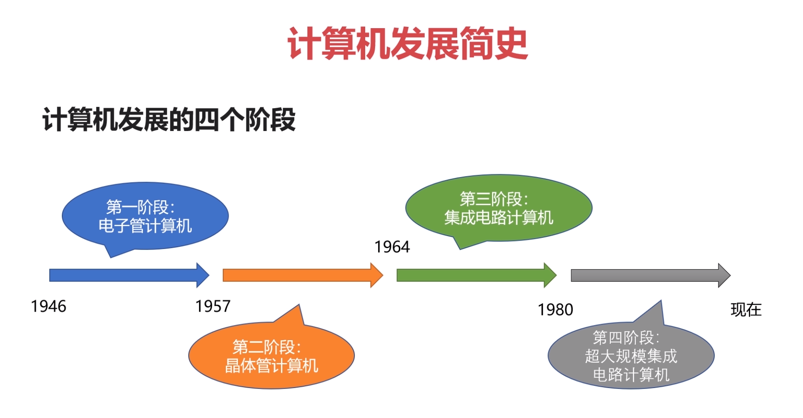

### 第一阶段：电子管计算机

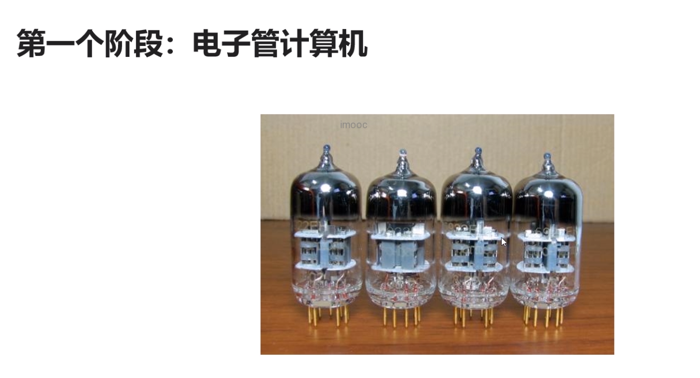

第二次世界大战是电子管计算机产生的催化剂。英国为了解密德国海军的密文。

* 没有计算机前,需要人手算
* 战争使用了飞机和火箭
* 打得准则需要计算射击参数
* 射击参数需要几千次运算才能计算出来

埃尼阿克(ENIAC)：第一阶段最著名的电子管计算机

* 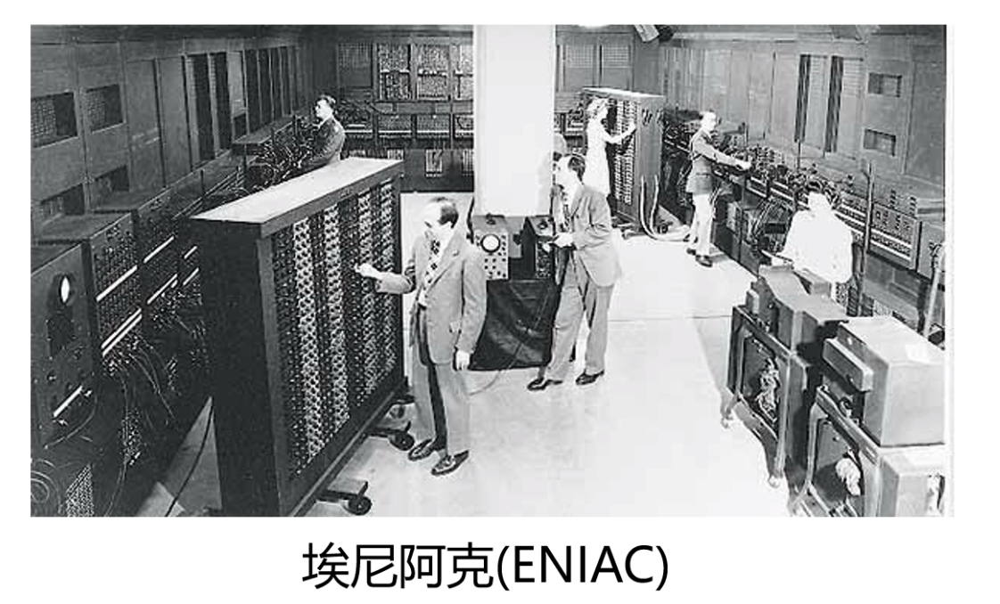
* 18000多个电子管
* 运行耗电量150千瓦
* 重量达30吨,占地1500平方英尺

电子管计算机的特点

* 集成度小,空间占用大
* 功耗高,运行速度慢
* 操作复杂,更换程序需要接线

### 第二阶段：晶体管计算机

贝尔实验室的三个科学家发明了晶体管

* 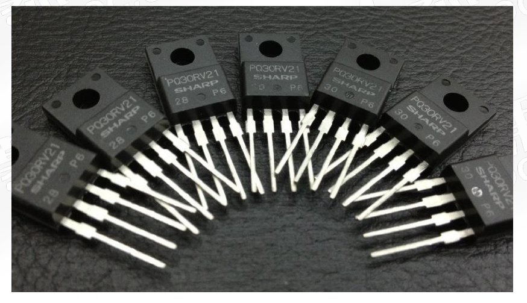

晶体管计算机

* 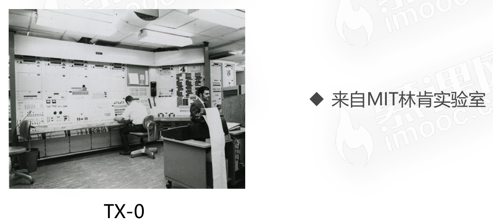
* 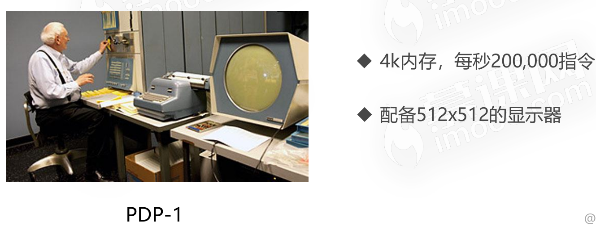

晶体管计算机的特点

* 集成度相对较高,空间占用相对小
* 功耗相对较低,运行速度较快
* 操作相对简单,交互更加方便

### 第三阶段：集成电路计算机

德州仪器的工程师发明了集成电路(IC)。

集成电路计算机的特点

* 计算机变得更小
* 功耗变得更低
* 计算速度变得更快
* 计算机具备进入千家万户的条件

操作系统雏形

* 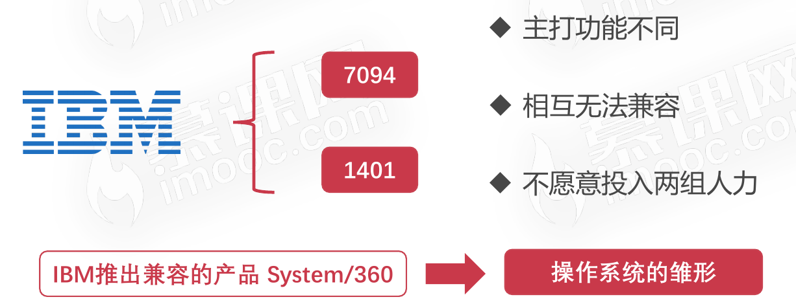

### 第四阶段：超大规模集成电路计算机

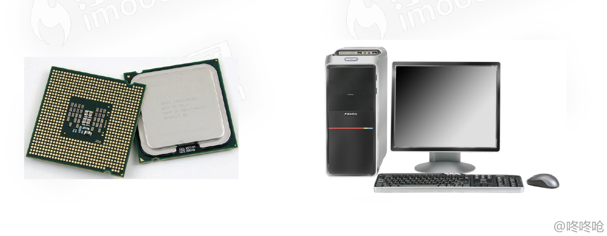

超大规模集成电路计算机的特点

*  一个芯片集成了上百万的晶体管
* 速度更快,体积更小,价格更低,更能被大众接受
* 用途丰富:文本处理、表格处理、高交互的游戏与应用

乔布斯在当时发明了最受欢迎的计算机

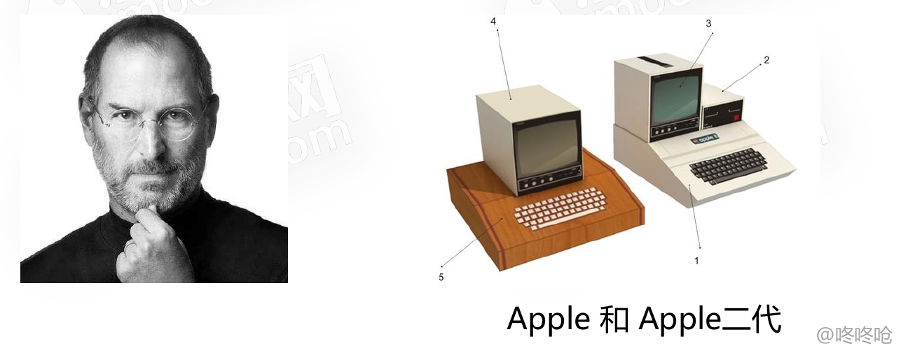

### 畅想未来 => 第五阶段：未来的计算机

#### 生物计算机

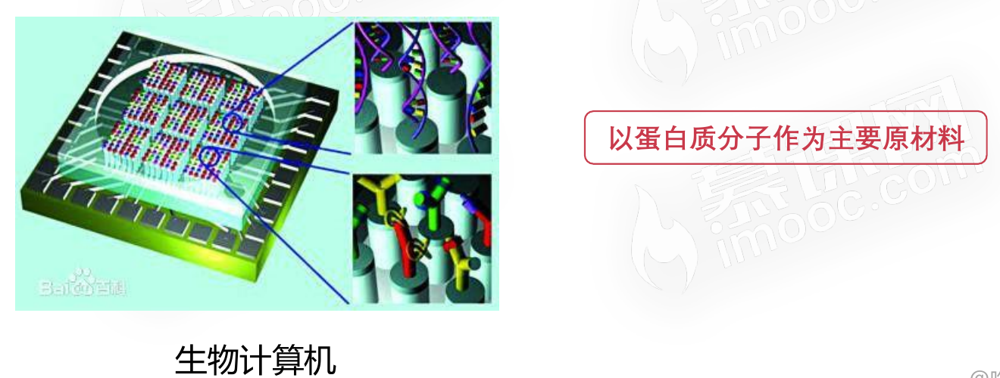

生物计算机的特点

* 体积小,效率高
* 不易损坏,生物级别的自动修复
* 不受信号干扰,无热损耗

#### 量子计算机

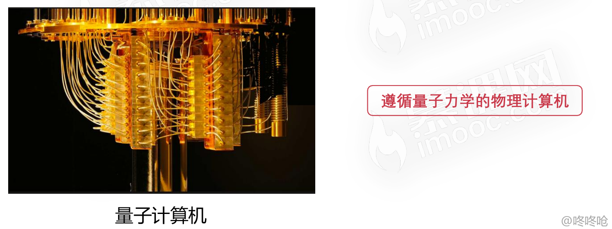

量子计算机当前发展阶段

* 2013年5月,谷歌和NASA发布D-Wave Two
* 2017年5月,中国科学院宣布制造出光量子计算机
* 2019年1月,IBM展示了世界首款商业化量子计算机

## 微型计算机的发展历史

### 受限于性能的单核CPU

* (1971~1973)500KHz频率的微型计算机(字长8位)
* (1973~1978)高于1MHz频率的微型计算机(字长8位)
* (1978~1985)500MHz频率的微型计算机(字长16位)
* (1985~2000)高于1GHz频率的微型计算机(字长32位)
* (2000~现在)高于2GHz频率的微型计算机(字长为64位)

### 摩尔定律

* 集成电路的性能,每18-24个月就会提升一倍

多核CPU的出现

* (2005) Intel奔腾系列双核CPU、AMD速龙系列
* (2006)Intel酷睿四核CPU
* Intel酷睿系列十六核CPU
* Intel至强系列五十六核CPU