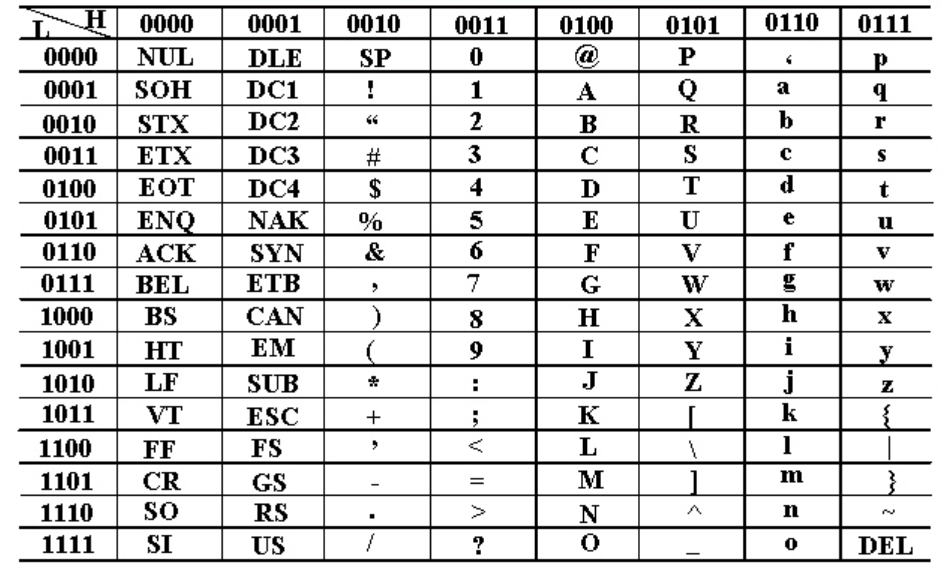
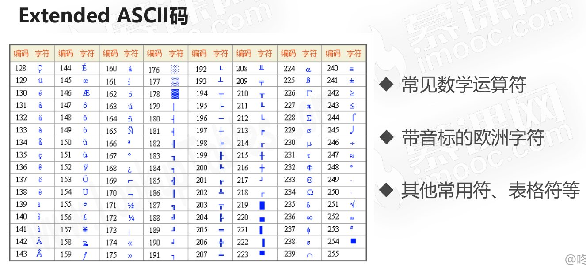

# 计算机的字符与编码集

## 字符编码集的历史

* ASCII码
* Extended ASCII码
* 字符编码集的国际化

### ASCII码

* 使用7个bits就可以完全表示ASCII码
* 包含95个可打印字符
* 33个不可打印字符(包括控制字符)
* 33 + 95 = 128 = 27
* 

### Extended ASCII码

由于ASCII码中很多应用或者国家中的符号都无法表示，比如数学符号：`÷ ≠ ≥ ≈ π`，所以各厂商对ASCII码进行扩充，由7bits => 8bits = 28 = 256个字符。

### 字符编码集的国际化

* 欧洲、中亚、东亚、拉丁美洲国家的语言多样性
* 语言体系不一样,不以有限字符组合的语言
* 中国、韩国、日本等的语言最为复杂

## 中文编码集

### GB2312

* 全称：《信息交换用汉字编码字符集——基本集》
* 一共收录了 7445 个字符
* 包括 6763 个汉字和 682 个其它符号

### GBK

* 全称：《汉字内码扩展规范》
* 向下兼容GB2312,向上支持国际ISO标准
* 收录了21003个汉字,支持全部中日韩汉字

### Unicode

* 兼容全球的字符集：统一码、万国码、单一码
* Unicode定义了世界通用的符号集,UTF-*实现了编码
* UTF-8以字节为单位对Unicode进行编码
* Windows系统默认使用GBK编码；编程推荐使用UTF-8编码

