# 计算机总线

## 预备知识

### 冯诺依曼机的组成

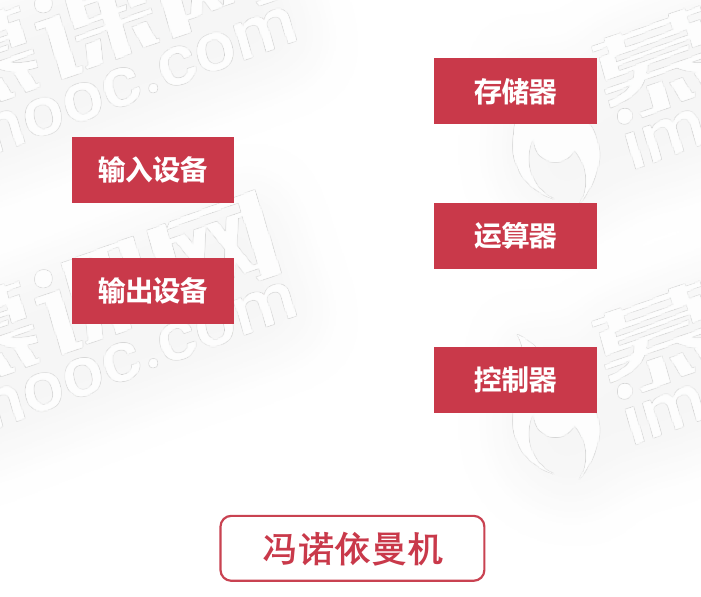

### 计算机硬件与冯诺依曼机的对应关系

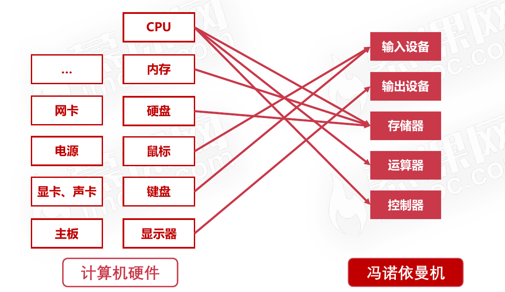

## 总线的概述

### 总线的概述

* 提供了对外连接的接口
* 不同设备可以通过USB接口进行连接
*  连接的标准,促使外围设备接口的统一
* 总线是为了解决不同设备之间的通信问题
* 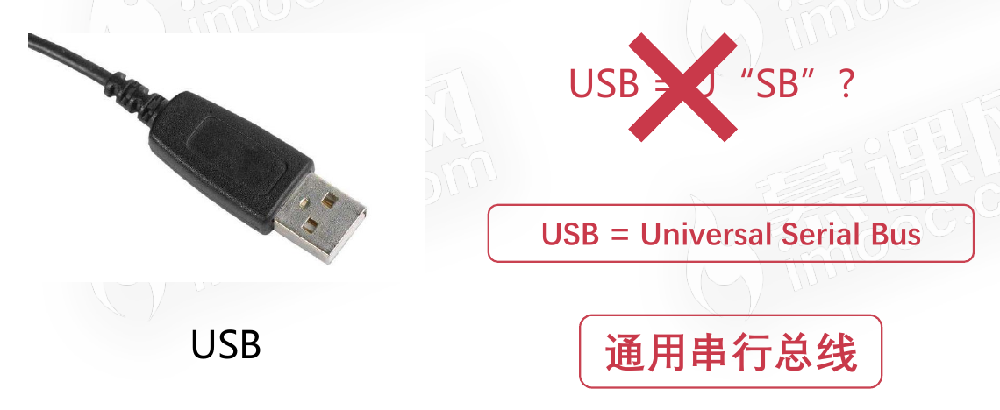
* 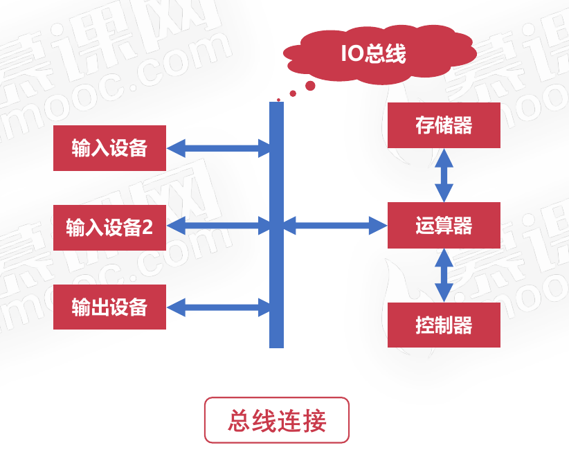

### 总线的分类

* 片内总线
* 系统总线

#### 片内总线

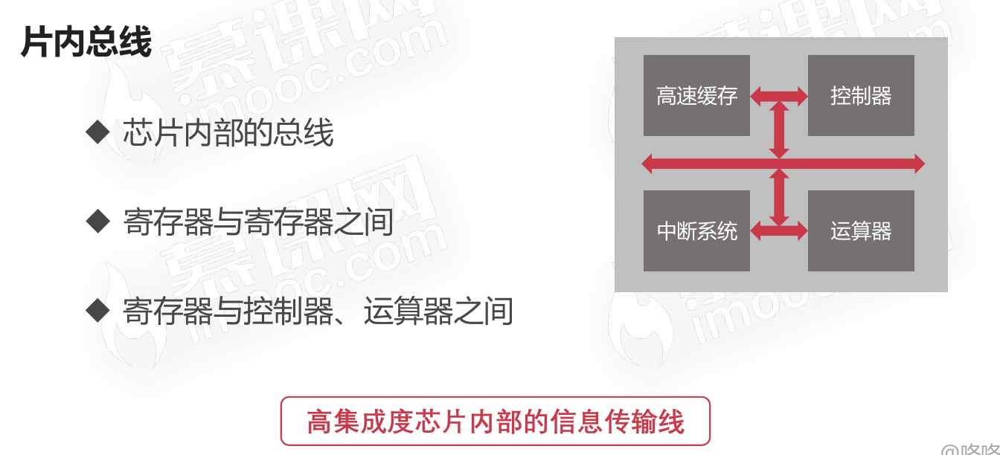

#### 系统总线

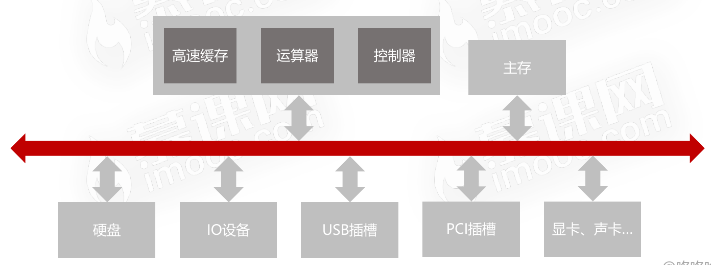

### 系统总线的分类

* 数据总线
* 地址总线
* 控制总线
* 这些总线主要是CPU、主内存、IO设备、各组件之间的信息传输线

#### 数据总线

* 双向传输各个部件的数据信息
* 数据总线的位数(总线宽度)是数据总线的重要参数。一般与CPU位数相同(32位、64位)。比如数据总线的位数为32，表示一次可以传输4bytes的数据.

#### 地址总线

* 指定源数据或目的数据在内存中的地址
* 地址总线的位数与存储单元有关
* 地址总线位数=n,寻址范围:0~2n

#### 控制总线

* 控制总线是用来发出各种控制信号的传输线
* 控制信号经由控制总线从一个组件发给另外一个组件
* 控制总线可以监视不同组件之间的状态(就绪/未就绪)

## 总线的仲裁

### 为什么需要总线仲裁

* 为了解决总线使用权的冲突问题
* 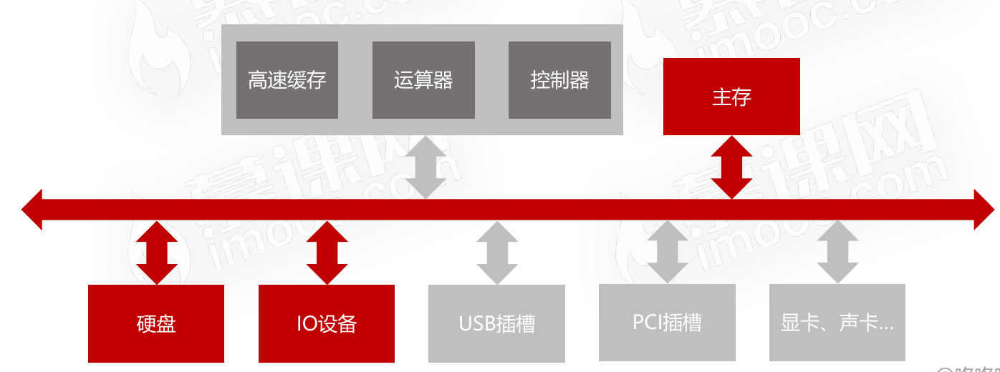

### 总线仲裁的方法

* 链式查询
* 计时器定时查询
* 独立请求

#### 链式查询

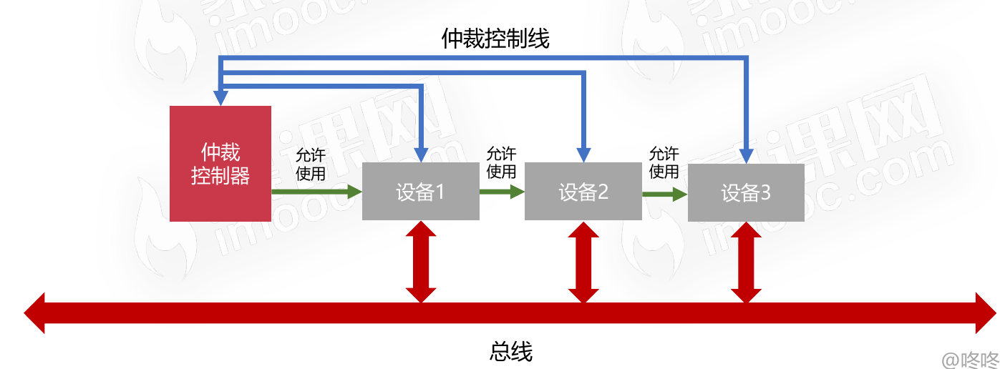

#### 链式查询的特点

* 好处
  * 电路复杂度低,仲裁方式简单
* 坏处
  * 优先级低的设备难以获得总线使用权
  * 对电路故障敏感

#### 计时器定时查询

* 仲裁控制器对设备编号并使用计数器累计计数
* 接收到仲裁信号后,往所有设备发出计数值
* 计数值与设备编号一致则获得总线使用权

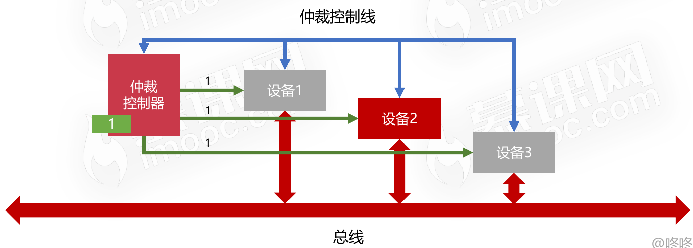

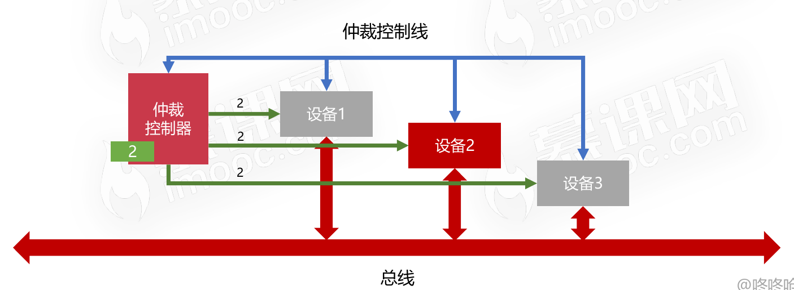

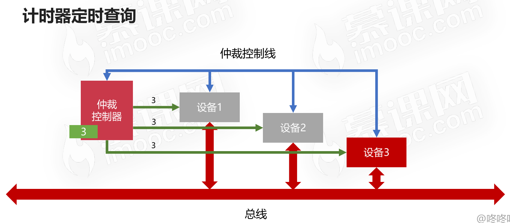

#### 独立请求

* 每个设备均有总线独立连接仲裁器
* 设备可单独向仲裁器发送请求和接收请求
*  当同时收到多个请求信号,仲裁器有权按优先级分配使用权

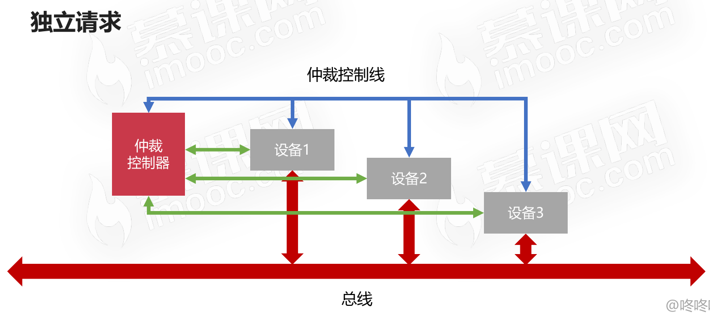

#### 独立请求的特点

* 好处
  * 响应速度快,优先顺序可动态改变
* 坏处
  * 设备连线多,总线控制复杂

## 总线的仲裁

* 串联优先级判别
* 并联优先级判别
* 循环优先级判别

### 串联优先级判别

* 优先级高的设备经常得到总线使用权限
* 优先级低的设备长时间无法得到总线

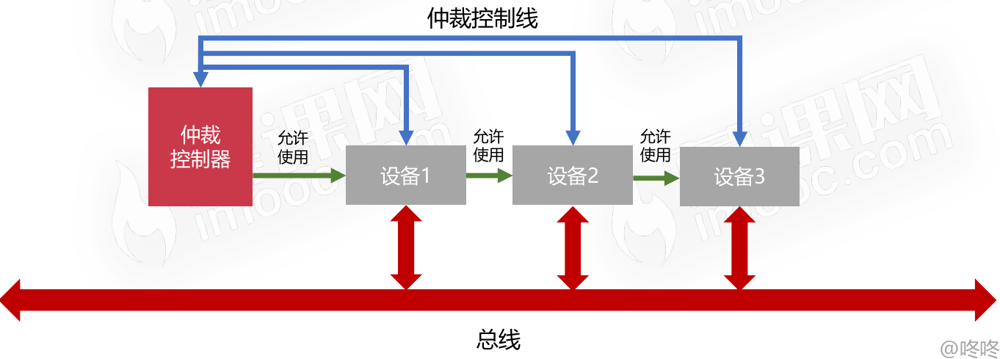

### 并联优先级判别

* 优先级高的设备经常得到总线使用权限
* 优先级低的设备长时间无法得到总线

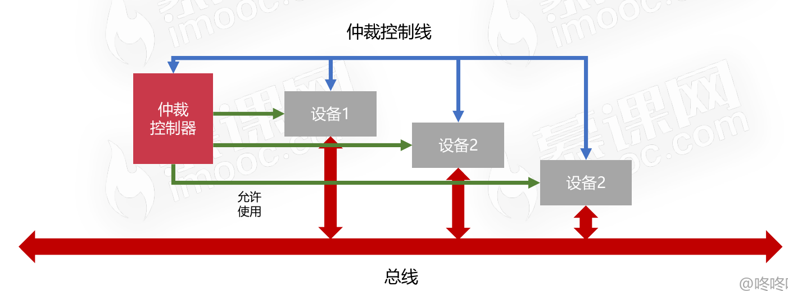

### 循环优先级判别

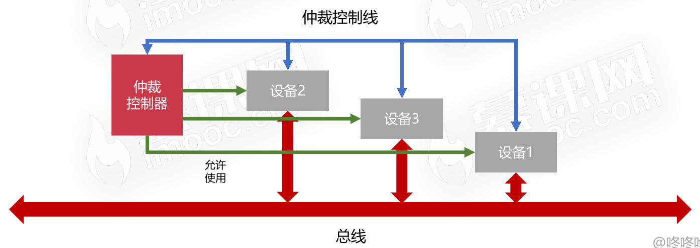

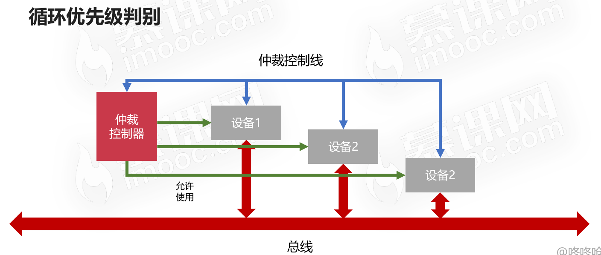

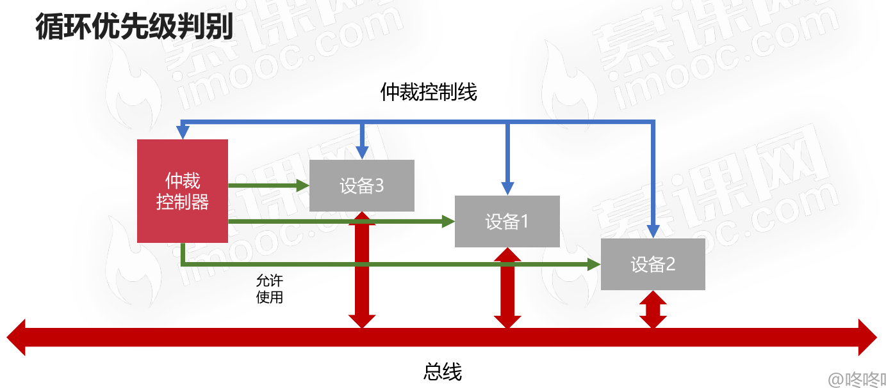