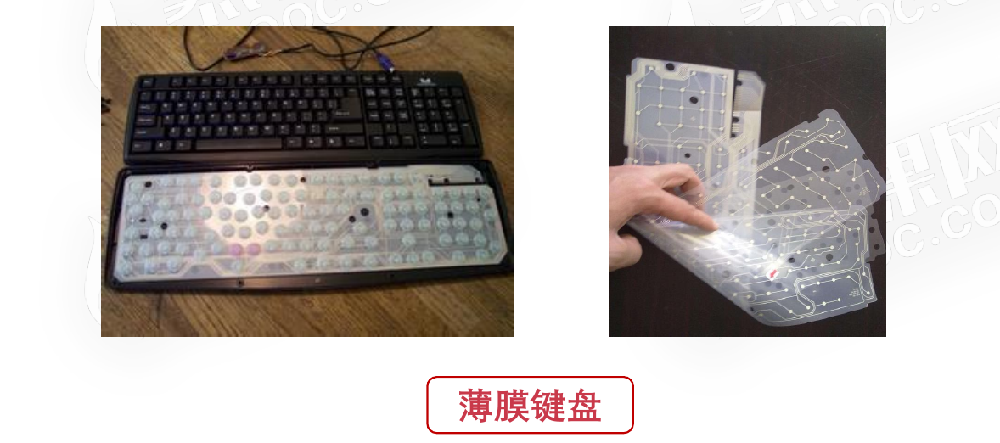
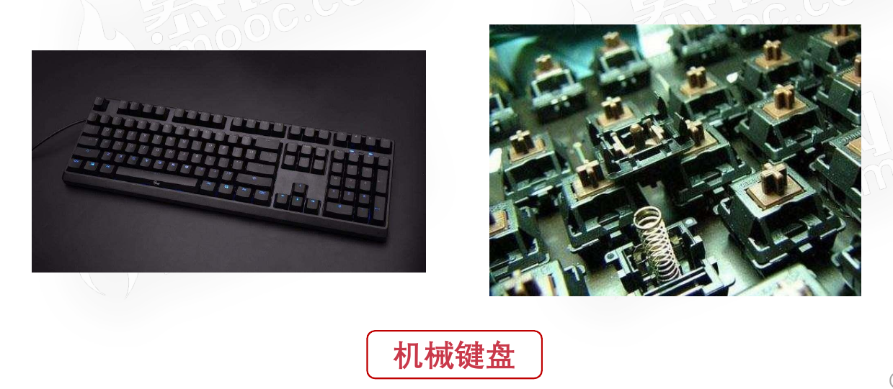
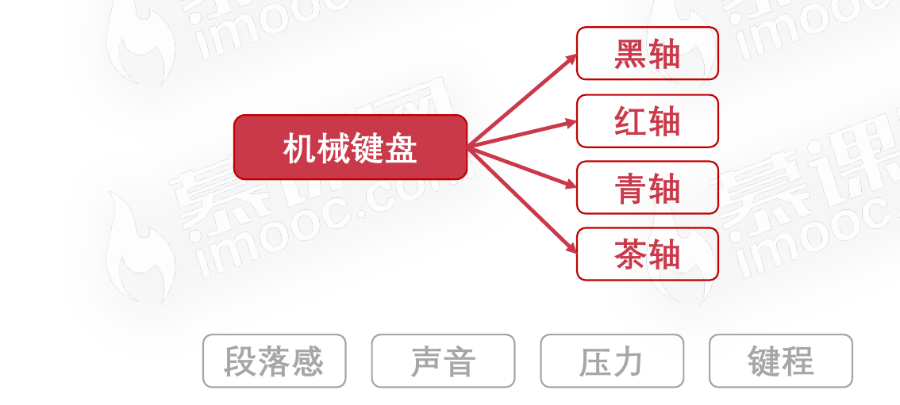
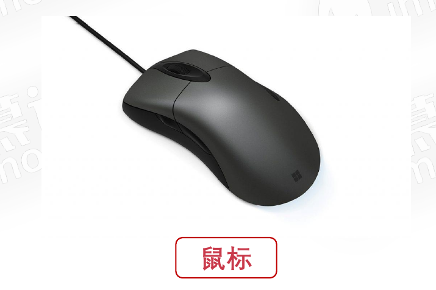
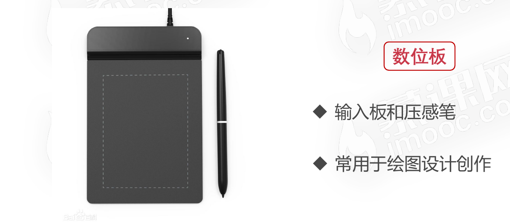
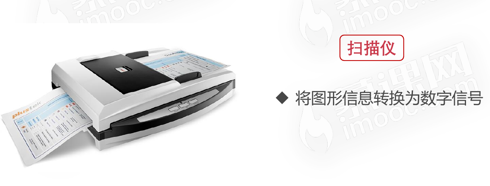
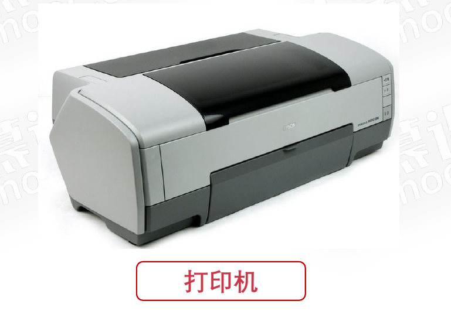
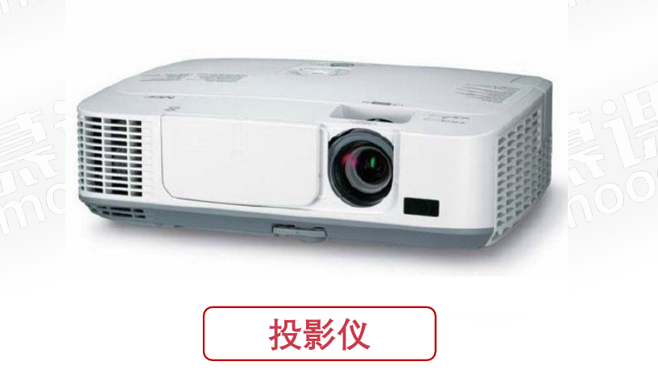
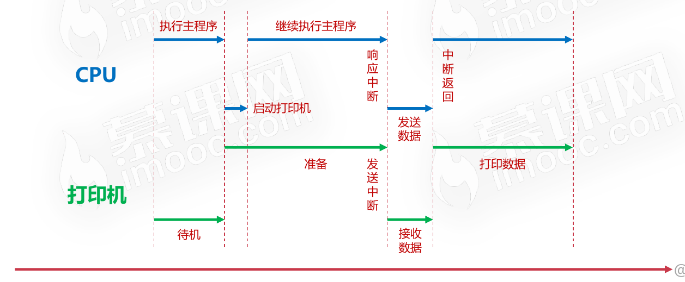
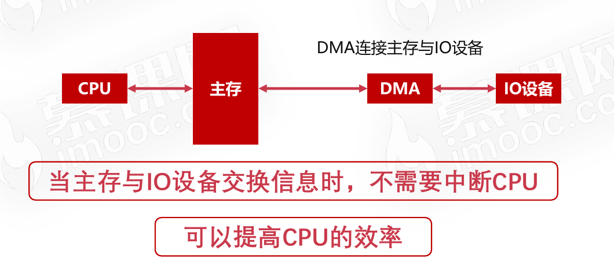

# 计算机的输入输出设备

## 常见的输入输出设备

### 输入设备

* 字符输入设备
  * 薄膜键盘
    * 
  * 机械键盘
    * 
    * 
  * 电容键盘
* 图像输入设备
  * 鼠标
    * 
  * 数位板
    * 
  * 扫描仪
    * 

### 输出设备

* 显示器
  * 
* 打印机
  * 
* 投影仪
  * 

## 输入输出接口的通用设计

* 数据线
* 状态线
* 命令线
* 设备选择线

### 数据线

* 是I/O设备与主机之间进行数据交换的传送线
* 单向传输数据线和双向传输数据线

### 状态线

* IO设备状态向主机报告的信号线
* 查询设备是否已经正常连接并就绪
* 查询设备是否已经被占用

### 命令线

* CPU向设备发送命令的信号线
* 发送读写信号
* 发送启动停止信号

### 设备选择线

* 主机选择I/O设备进行操作的信号线
* 对连在总线上的设备进行选择

## CPU与IO设备的通信

* 程序中断
* DMA(直接存储器访问)

CPU与IO设备的通信存在`CPU速度与IO设备速度不一致`的问题。

### 程序中断

* 当外围IO设备就绪时,向CPU发出中断信号
* CPU有专门的电路响应中断信号
* 
* 程序中断是提供低速设备通知CPU的一种异步的方式
* CPU可以高速运转同时兼顾低速设备的响应

### DMA(直接存储器访问)

* DMA直接连接主存与IO设备
* DMA工作时不需要CPU的参与
* 

#### DMA(直接存储器访问)的方式

* 硬盘
* 外置显卡

