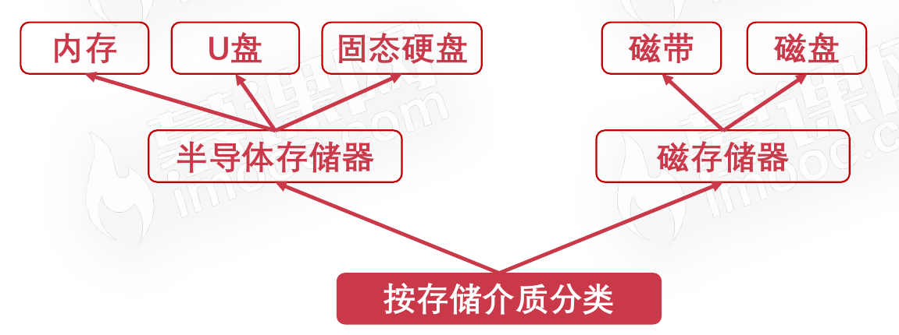
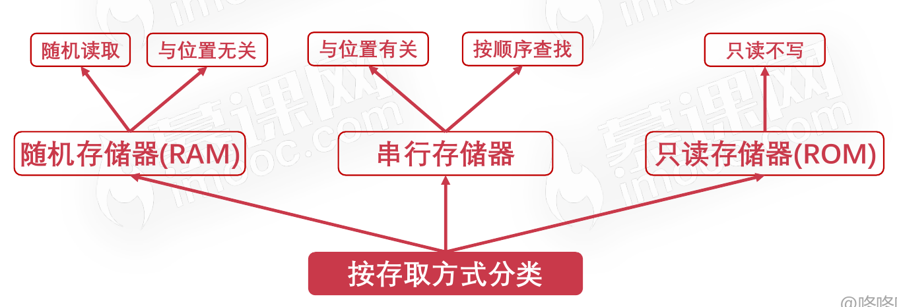
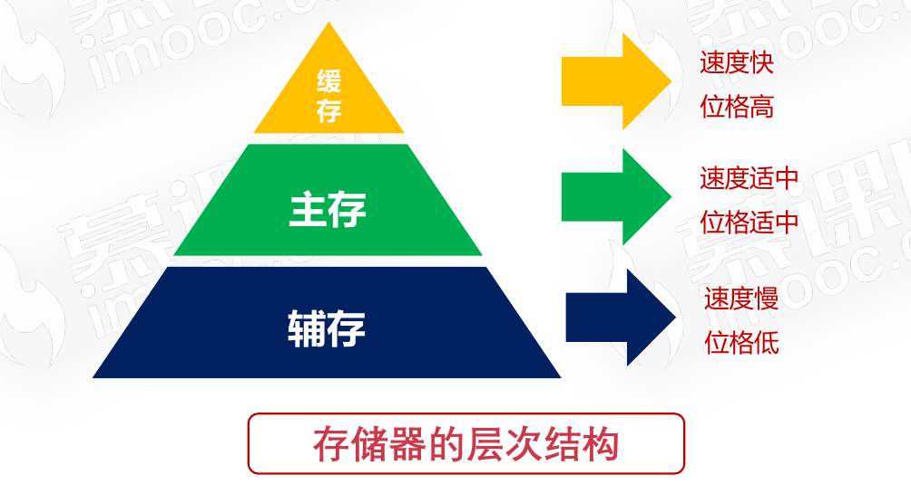
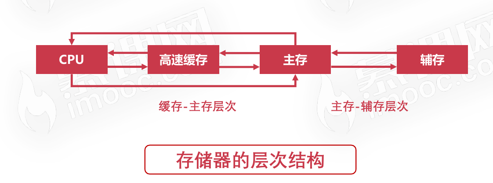
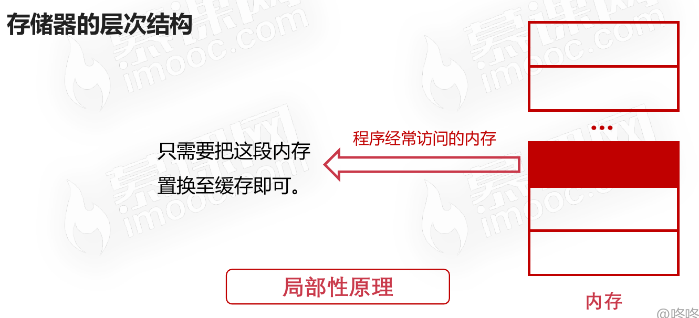

# 计算机存储器概览

## 存储器的分类

### 按存储介质分类

### 按存取方式分类

## 存储器的层次结构

## 存储器的局部性原理

### 缓存-主存层次的局部性原理

#### 目的

为了解决主存速度不足的问题。

#### 实现

在CPU与主存之间增加一层速度快(容量小)的Cache。

#### 原理内容

局部性原理是指CPU访问存储器时,无论是存取指令
还是存取数据,所访问的存储单元都趋于聚集在一个
较小的连续区域中。

#### 缓存-主存层次的局部性原理示意图

### 主存-辅存层次的局部性原理

#### 目的

解决主存容量不足的问题

#### 实现

主存之外增加辅助存储器(磁盘、SD卡、U盘等)

