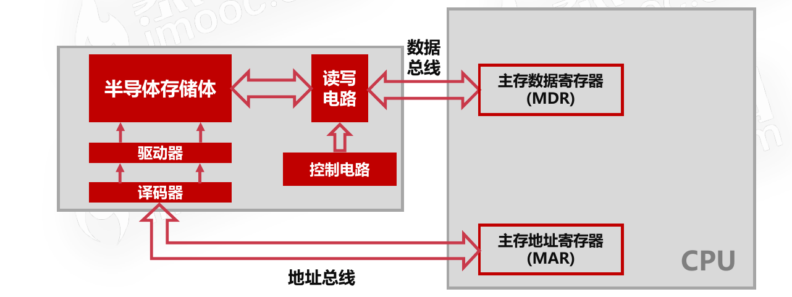
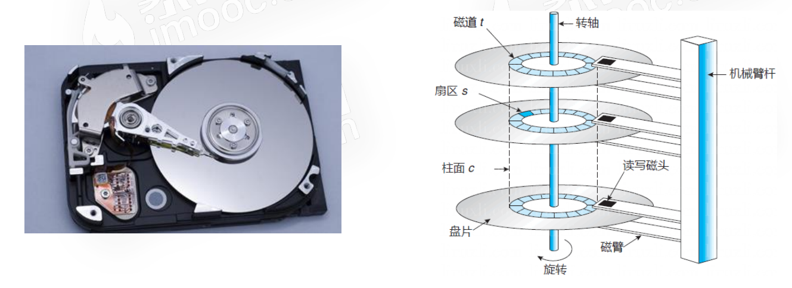
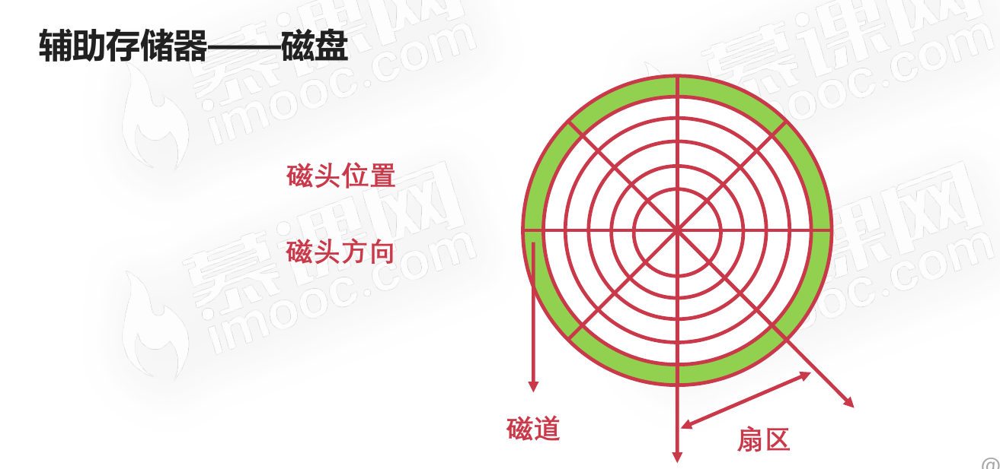
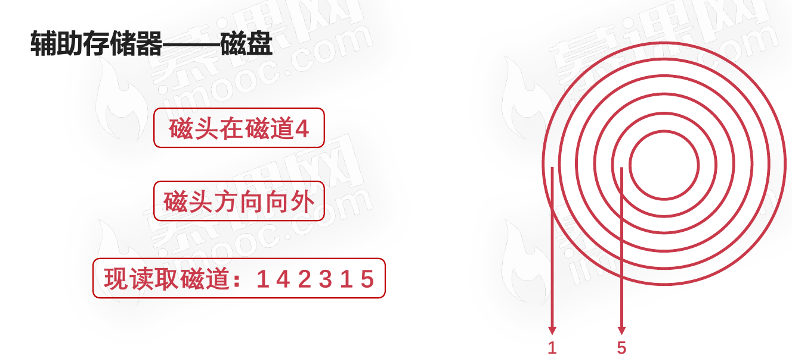
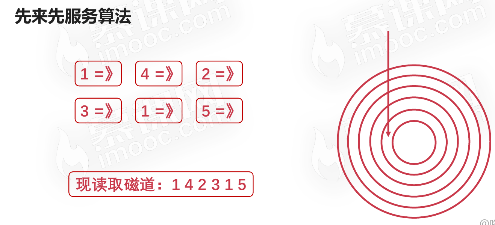
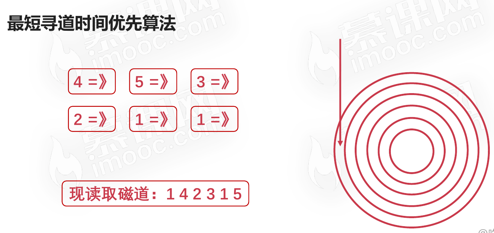
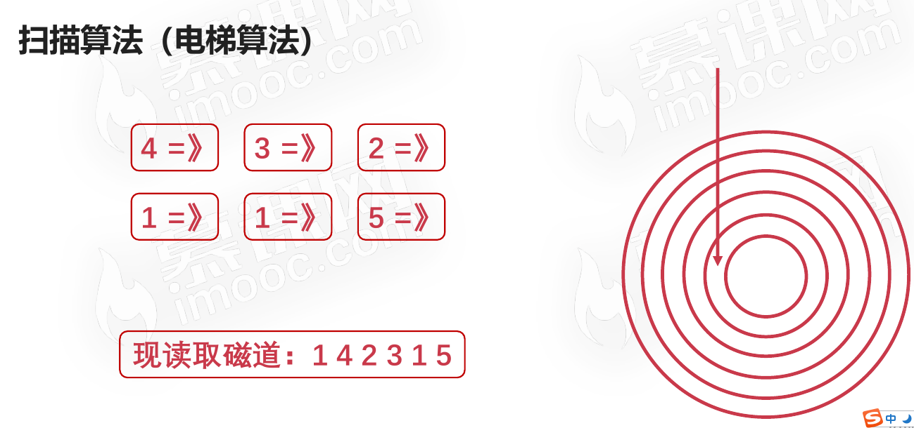
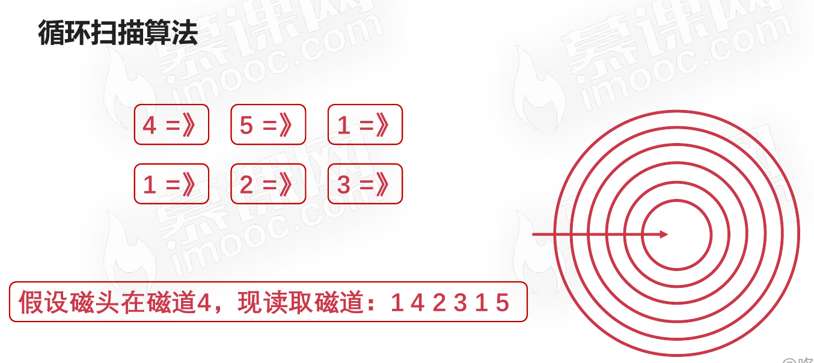

# 计算机的主存储器与辅助存储器

先思考一个问题：计算机断电，为什么内存数据丢失，磁盘数据不会丢失？

## 主存储器——内存

内存也叫RAM(随机存取存储器:Random Access Memory)，因为RAM通过电容存储数据,必须隔一段时间刷新一次，如果掉电,那么一段时间后将丢失所有数据。

### 内存与CPU的结构图

### 内存与操作系统位数的关系

#### 32位操作系统

计算机寻址范围和地址总线的根数N有关，为2N。32位操作系统的地址总线位32个，所以最大寻址范围为：232 = 4 × 230 = 4GB，所以**32位操作系统最大可支持的内存为4GB。**

#### 64位操作系统

64位操作系统的地址总线位64个，所以最大寻址范围为：264 = 234 × 230 = 234 GB，所以**64位操作系统最大可支持的内存为234GB。**

## 辅助存储器——磁盘

### 磁盘的示意图

### 磁盘切面图

**磁盘表面是可磁化的硬磁特性材料，通过移动磁头径向运动读取磁道信息。**

### 磁盘的调度算法

通过以下示例来演示各个算法

#### 先来先服务算法

按顺序访问进程的磁道读写需求。

#### 最短寻道时间优先算法

* 与磁头当前位置有关
* 优先访问离磁头最近的磁道

#### 扫描算法(电梯算法)

* 每次只往一个方向移动
* 到达一个方向需要服务的尽头再反方向移动

#### 循环扫描算法(是对扫描算法的优化)

