# 计算机的高速缓存

## 高速缓存的工作原理

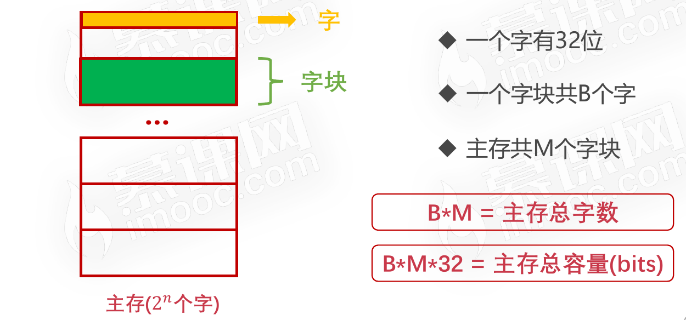

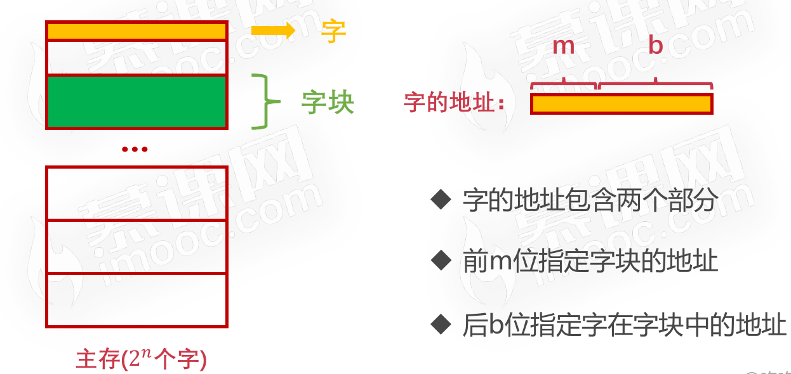

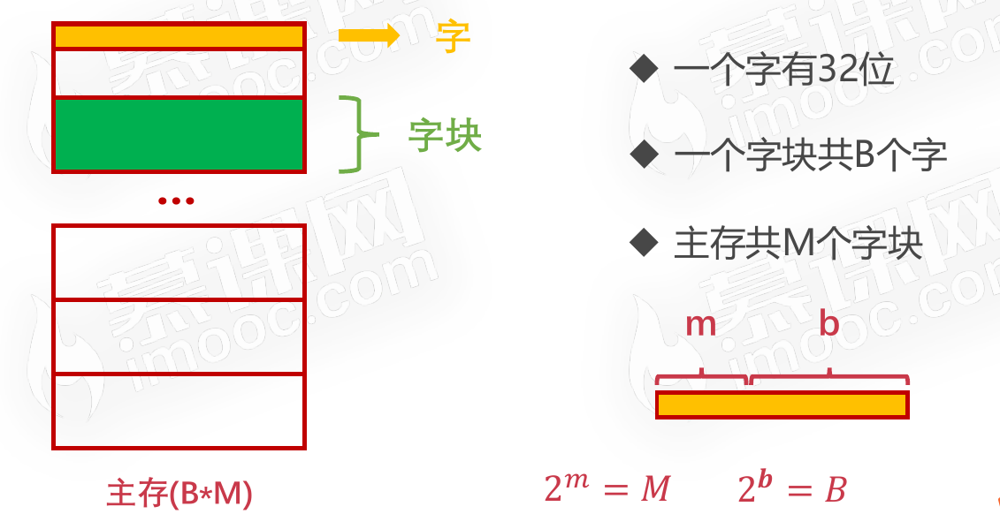

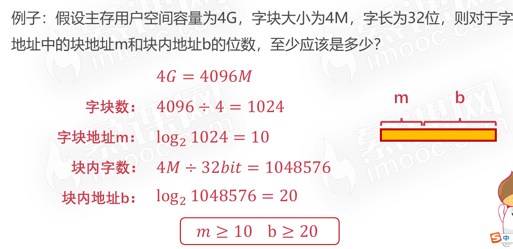

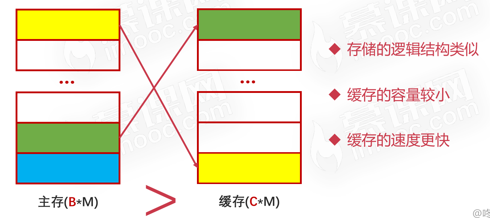

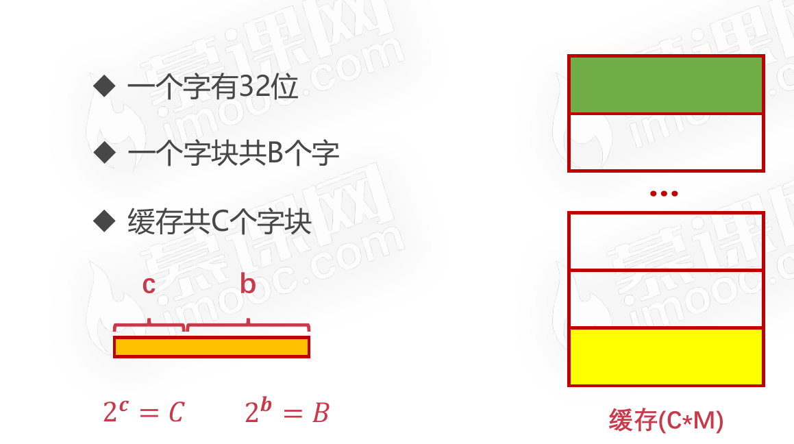

### 命中率

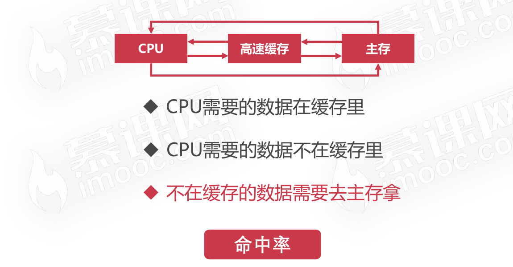

* 命中率是衡量缓存的重要性能指标
* 理论上CPU每次都能从高速缓存取数据的时候,命中率为1

### 高速缓存命中率计算公式

### 高速缓存访问效率计算公式

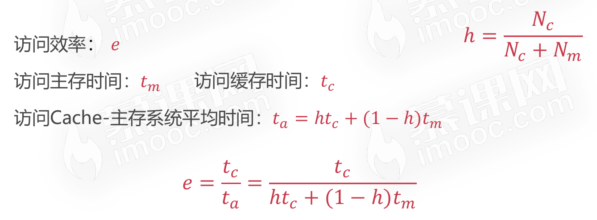

例子

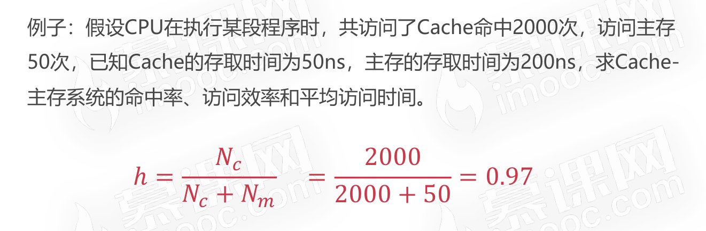

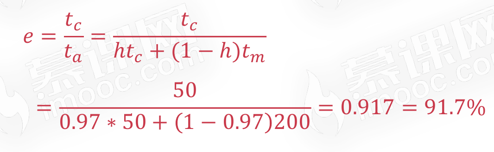

## 高速缓存的替换策略

### 需要高速缓存替换策略的原因

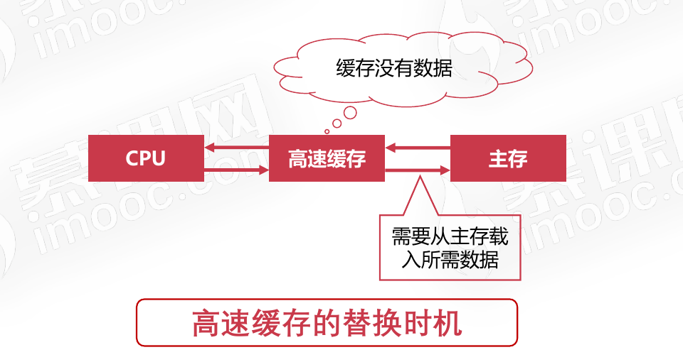

### 随机算法

* 就是每当需要进行缓存置换时，先从高速缓存中某个随机位置的数据移除，再将从主存中取到的要进行缓存的数据替换到高速缓存中的该随机位置处。

### 先进先出算法(FIFO)

* 把高速缓存看做是一个先进先出的队列
* 优先替换最先进入队列的字块
* 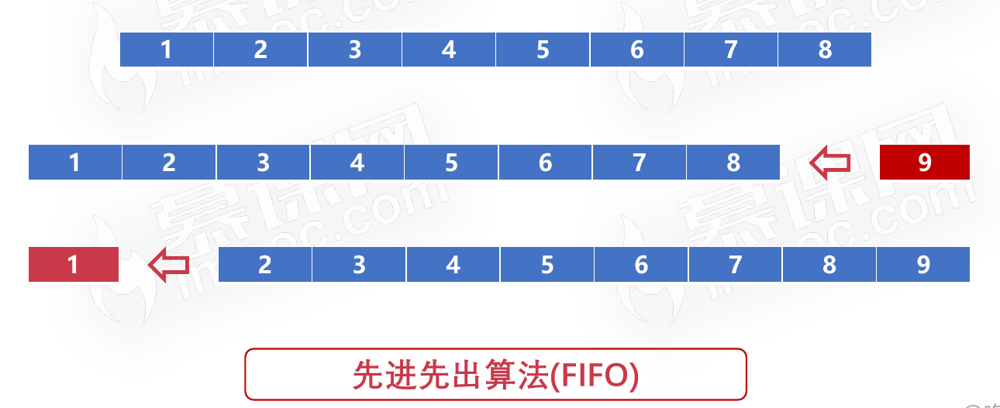

### 最不经常使用算法(LFU)

* 优先淘汰最不经常使用的字块
* 需要额外的空间记录字块的使用频率
* 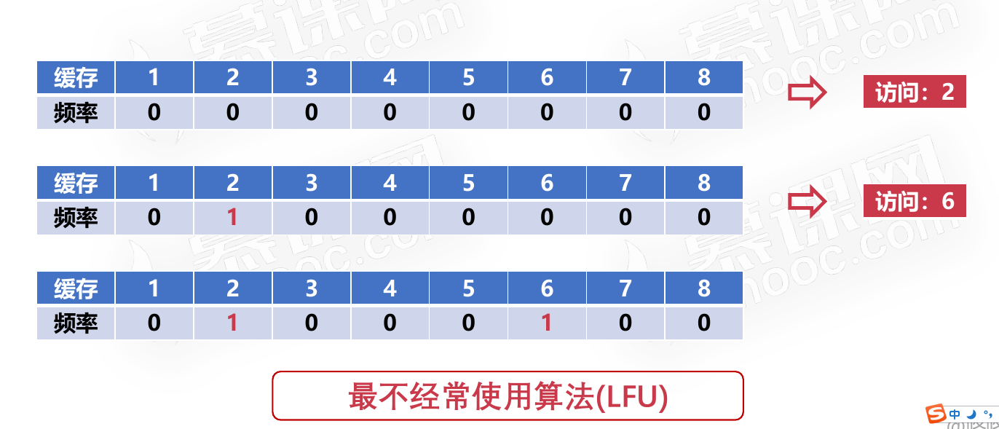
* 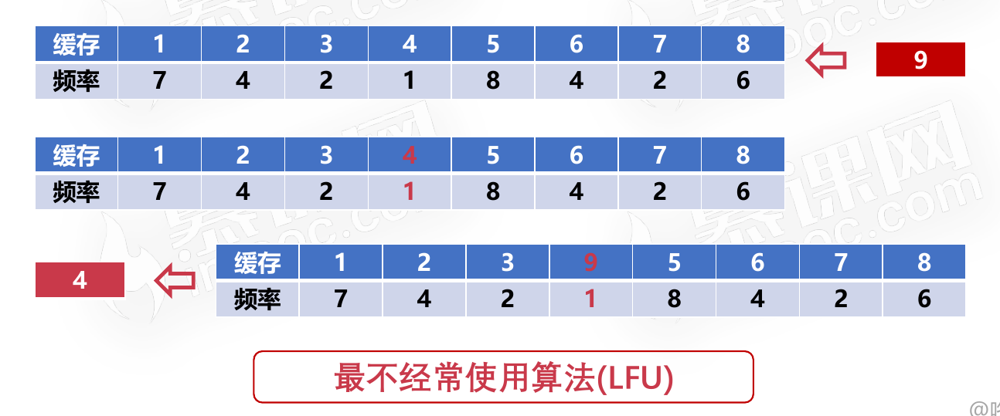

### 最近最少使用算法(LRU)

* 优先淘汰一段时间内没有使用的字块
* 有多种实现方法,一般使用双向链表
* 把当前访问节点置于链表前面(保证链表头部节点是最近使用的)
* 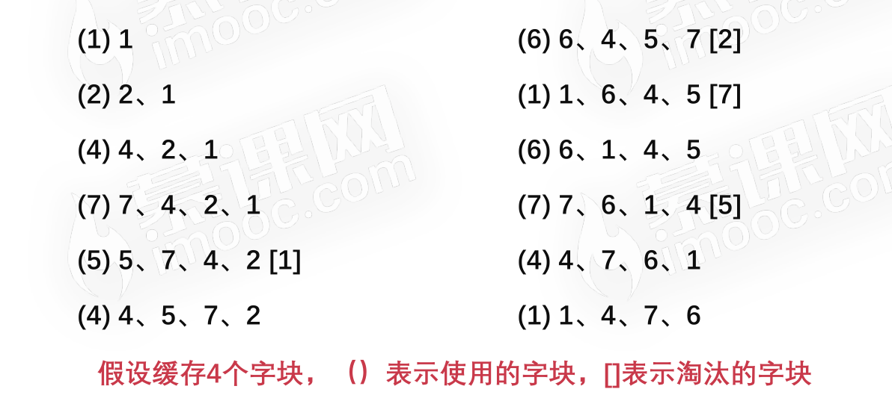

