# 计算机的指令系统

## 机器指令的形式

机器指令主要由两部分组成:操作码、地址码

### 操作码

* 操作码指明指令所要完成的操作
* 操作码的位数反映了机器的操作种类，比如某个操作码的位数为8，则该机器的操作种类最多有28=256种。

### 地址码

* 地址码直接给出操作数或者操作数的地址
* 地址码分三地址指令、二地址指令、一地址指令和零地址指令。
* 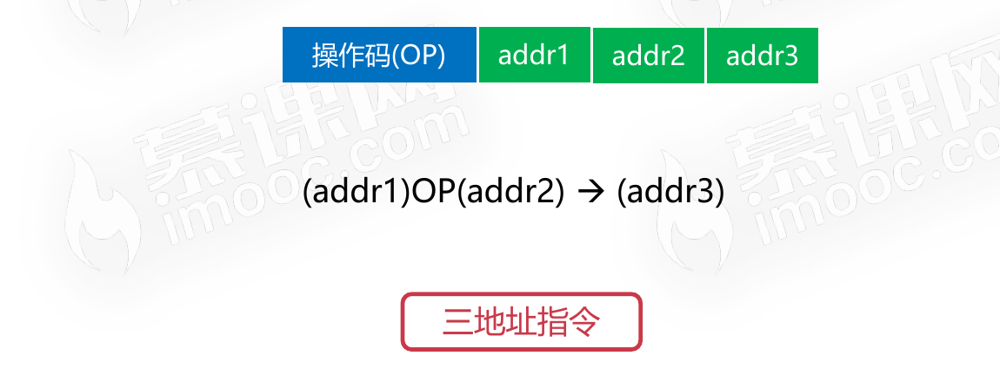
* 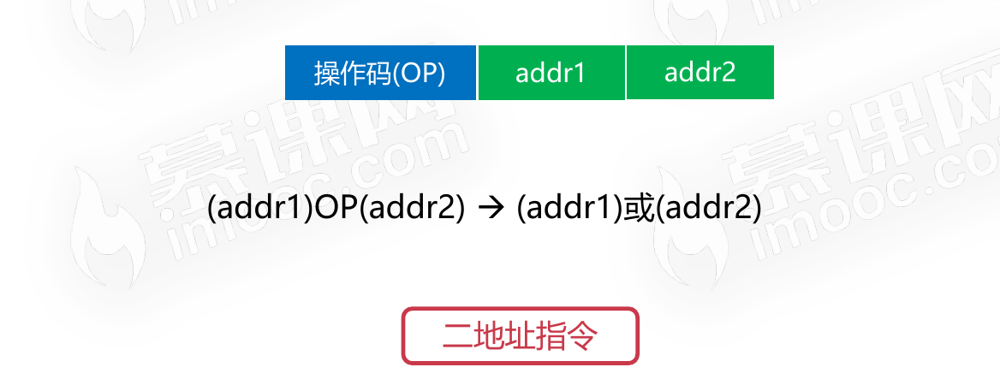
* 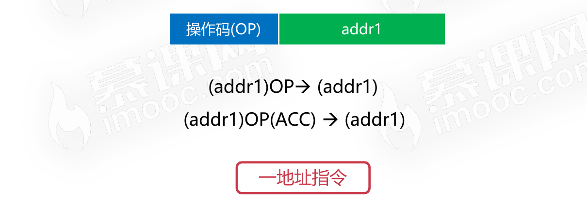
* 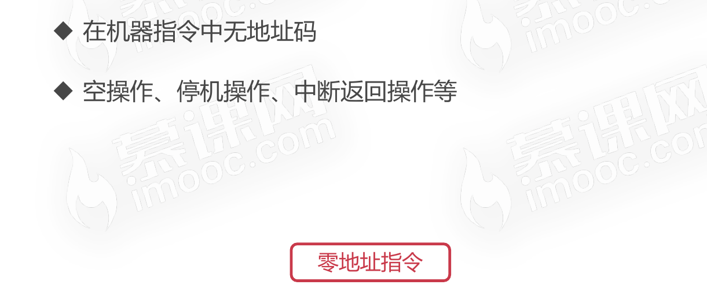

## 机器指令的操作类型

* 数据传输
  * 寄存器之间、寄存器与存储单元、存储单元之间传送
  * 数据读写、交换地址数据、清零置一等操作
* 算术逻辑操作
  * 操作数之间的加减乘除运算
  * 操作数的与或非等逻辑位运算
* 移位操作
  * 数据左移(乘2)、数据右移(除2)
  * 完成数据在算术逻辑单元的必要操作
* 控制指令
  * 等待指令、停机指令、空操作指令、中断指令等

## 机器指令的寻址方式

### 指令寻址

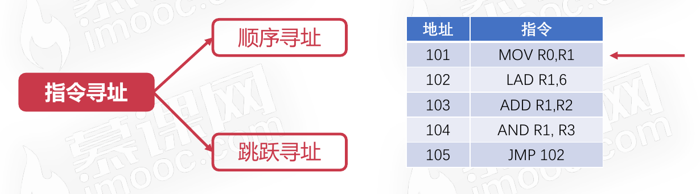

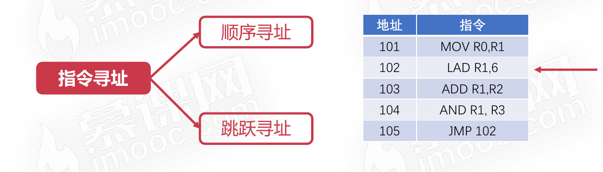

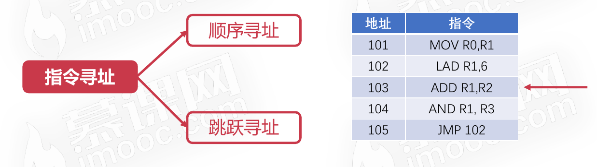

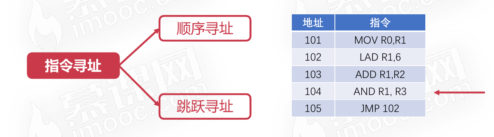

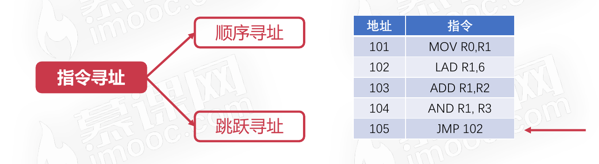

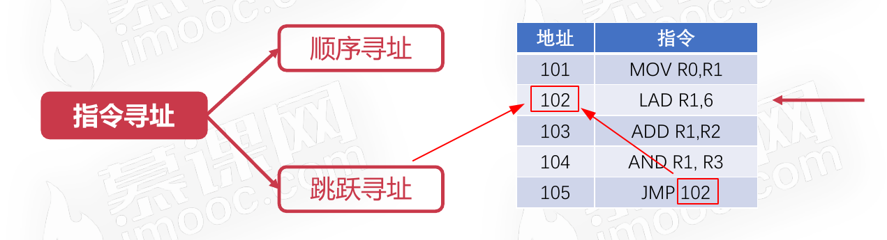

### 数据寻址

* 立即寻址
  * 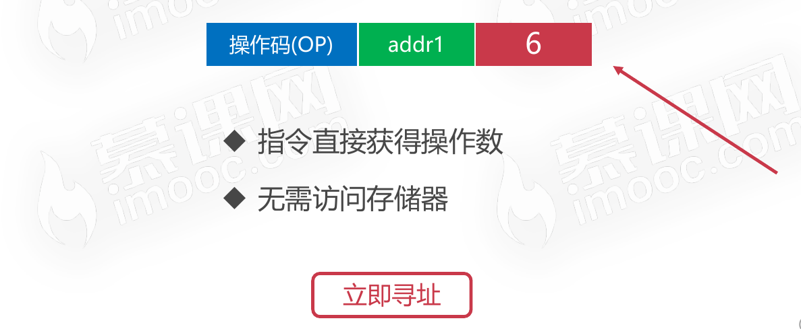
* 直接寻址
  * 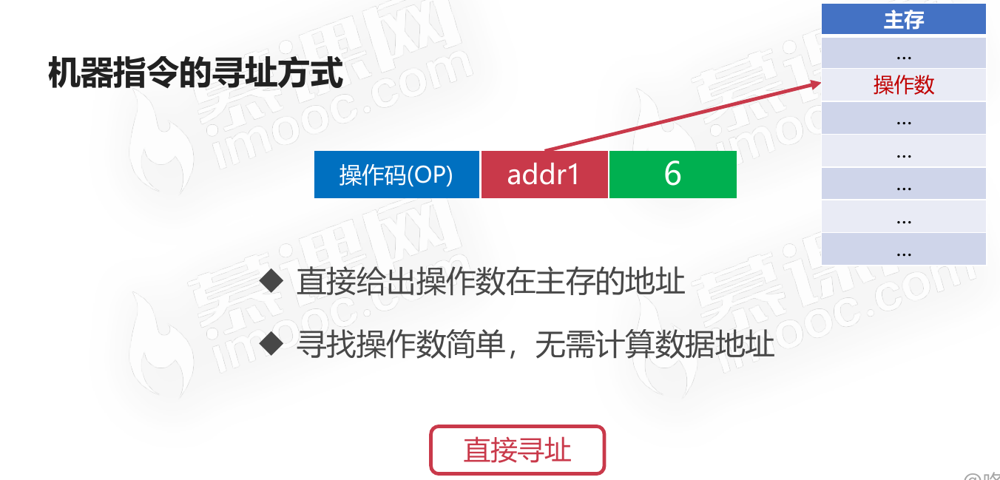
* 间接寻址
  * 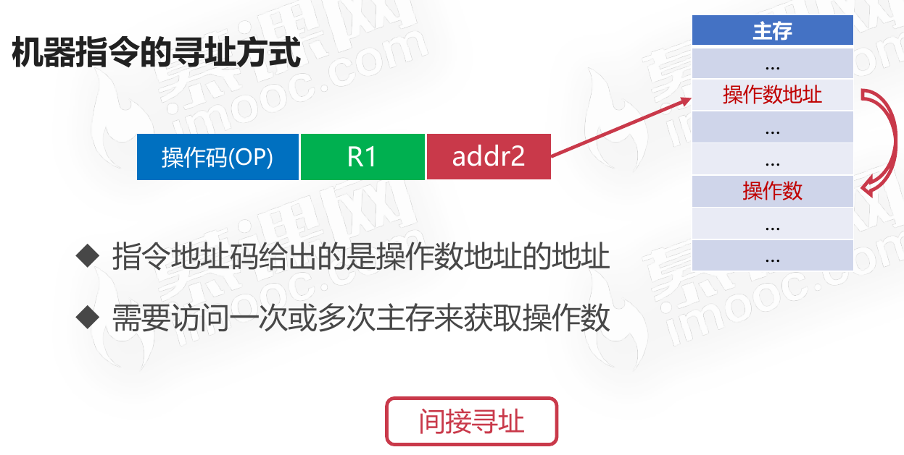

#### 数据寻址的三种方式各自的优缺点

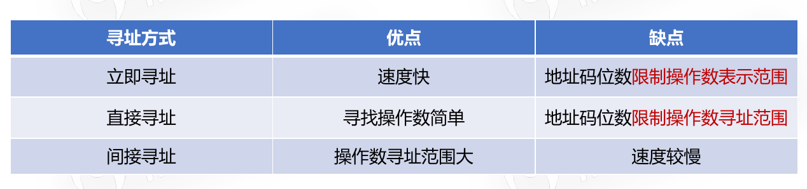