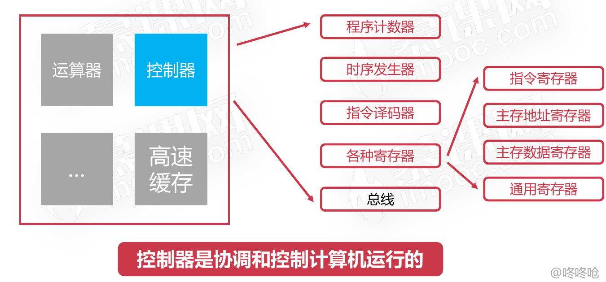

# 计算机的控制器

## 计算机控制器组成

### 程序计数器

* 程序计数器用来存储下一条指令的地址
* 循环从程序计数器中拿出指令
* 当指令被拿出时,指向下一条指令

### 时序发生器

* 电气工程领域,用于发送时序脉冲
* CPU依据不同的时序脉冲有节奏的进行工作

### 指令译码器

* 指令译码器是控制器的主要部件之一
* 计算机指令由操作码和地址码组成
* 翻译操作码对应的操作以及控制传输地址码对应的数据

### 指令寄存器

* 指令寄存器也是控制器的主要部件之一
* 从主存或高速缓存取计算机指令

### 主存地址寄存器

* 保存当前CPU正要访问的内存单元的地址

### 主存数据寄存器

* 保存当前CPU正要读或写的主存数据

### 通用寄存器

* 用于暂时存放或传送数据或指令
* 可保存ALU的运算中间结果
* 容量比一般专用寄存器要大