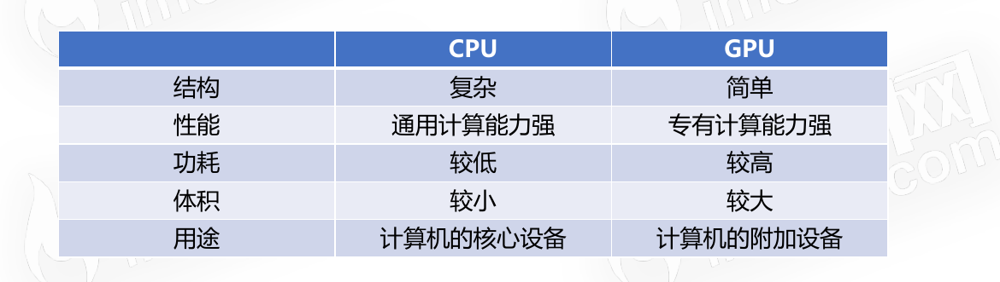
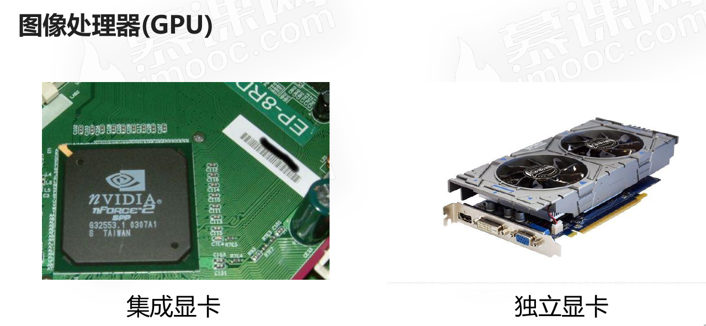
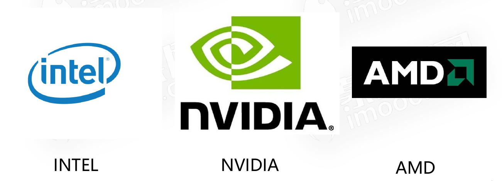
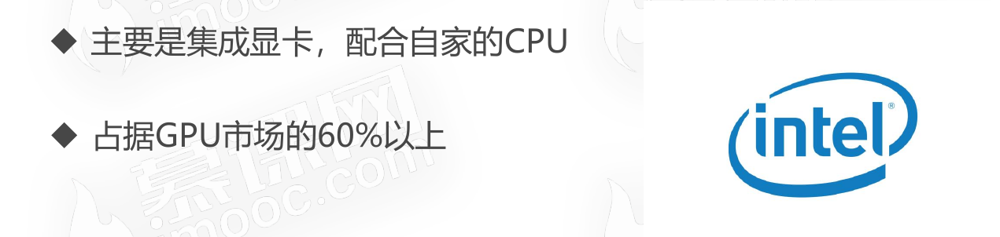
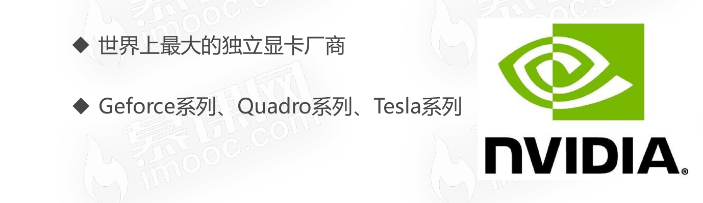
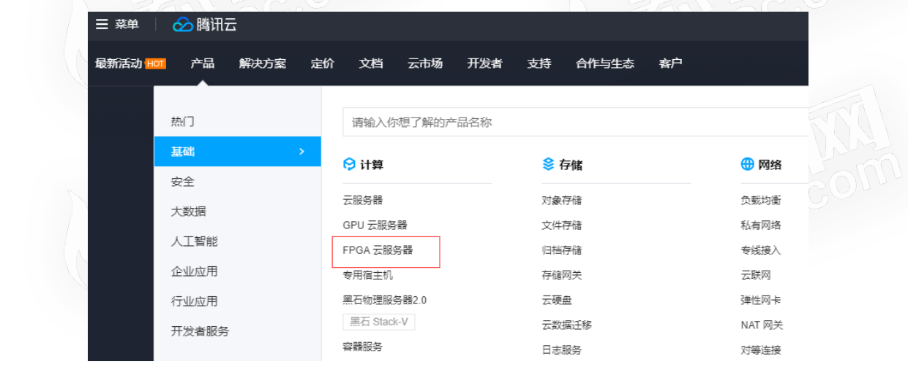
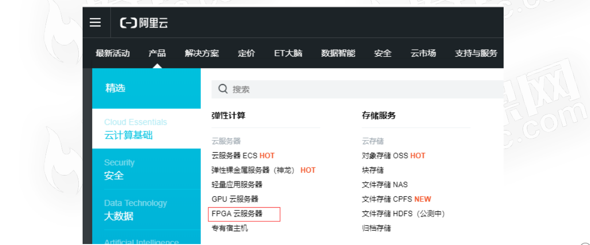
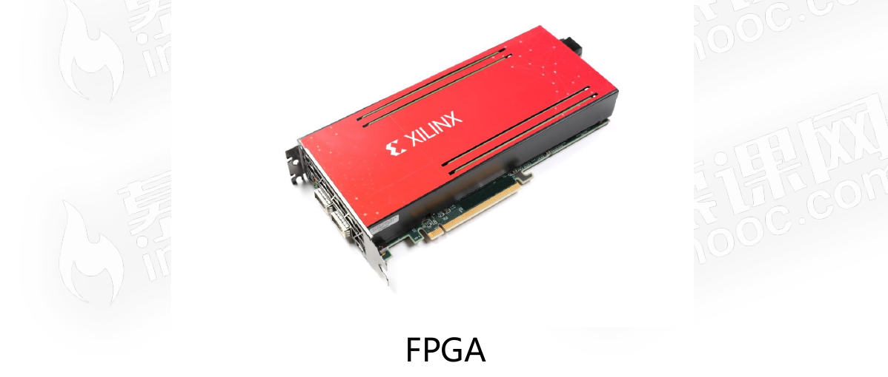
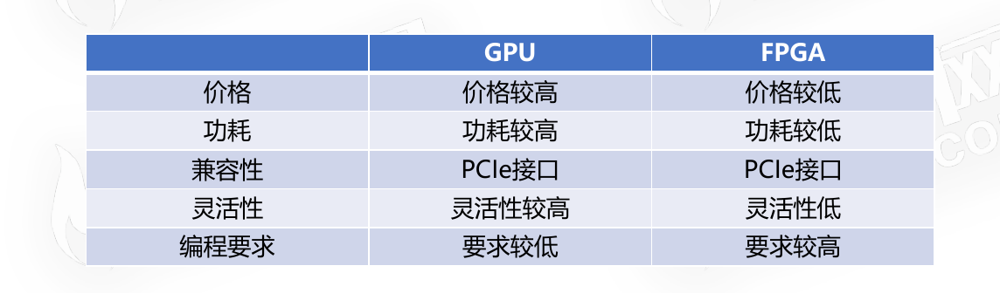

# 计算机的异构计算设备

## 图像处理器(GPU)

* 又称显示核心、视觉处理器、显示芯片
* 擅长执行复杂的数学和几何计算

### CPU和GPU的区别

### GPU常见于显卡中

### 图像处理器(GPU)的特点

### 常见显卡供应商

* Intel
  * 
* Nvidia
  * 
* AMD
  * 

## 现场可编程门阵列(FPGA)

* 是一种专用集成电路,诞生于1985年
* 电路级别的设备,属于硬件层面的开发
* AI人工智能的大热,FPGA逐渐走进大众的视野

### 现场可编程门阵列(FPGA)适用场景

* AI的大规模参数训练
* 音视频、图像处理等复杂计算

### GPU与现场可编程门阵列(FPGA)的区别

