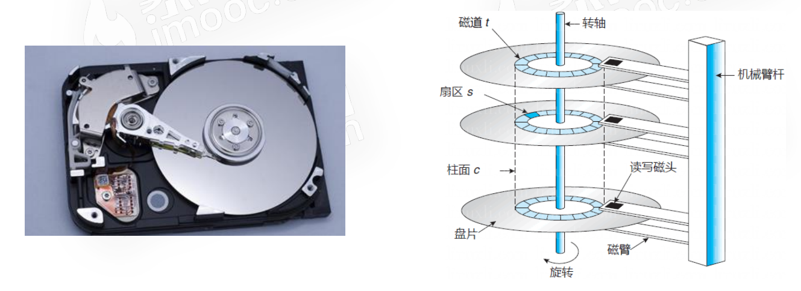
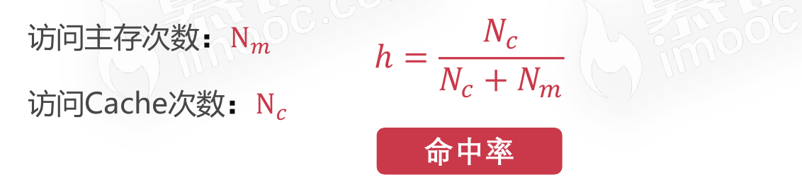
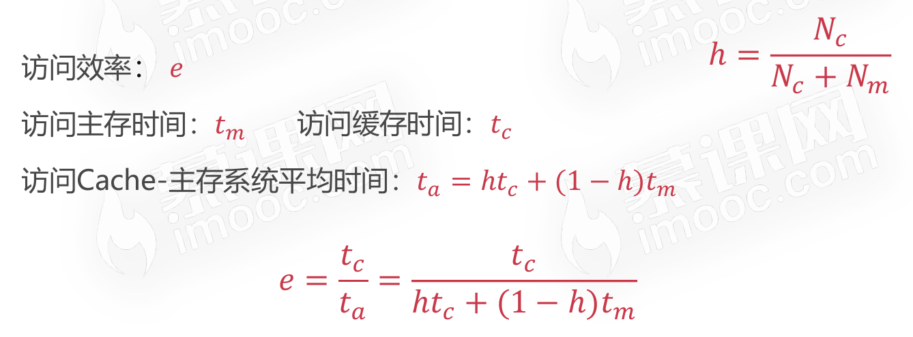
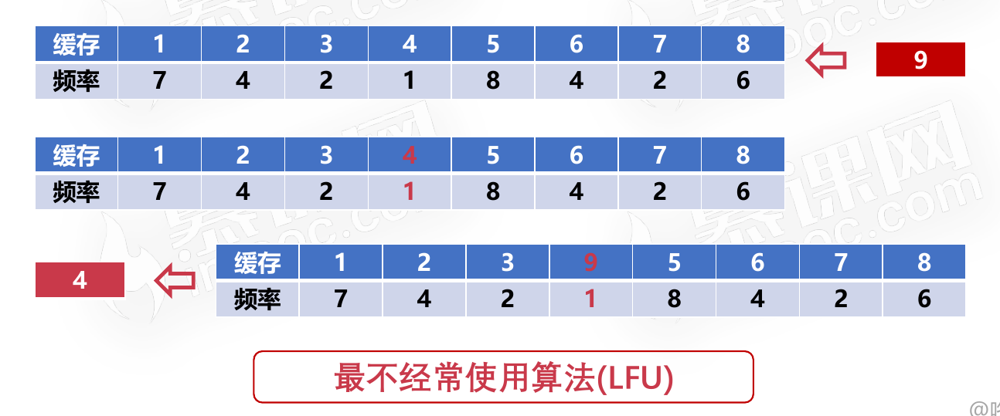
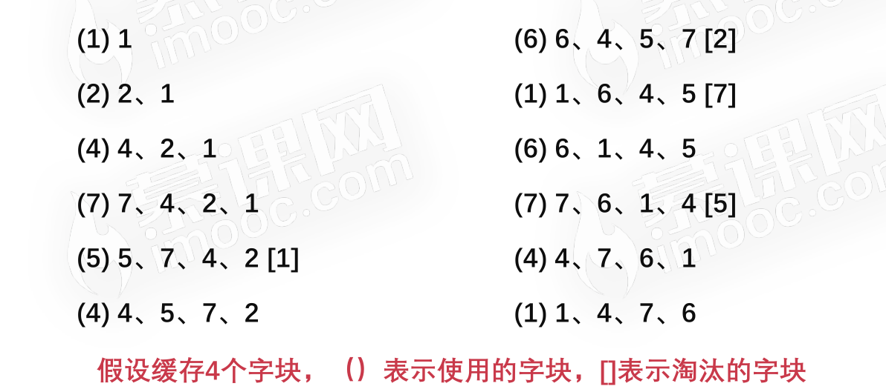
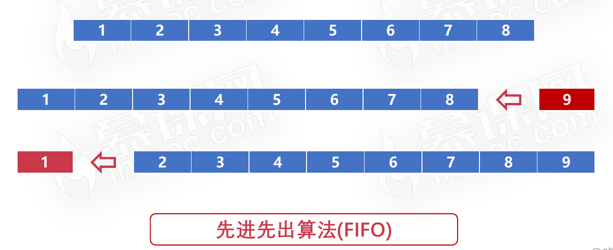
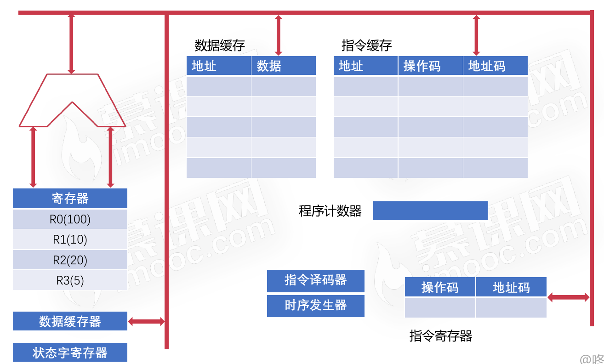
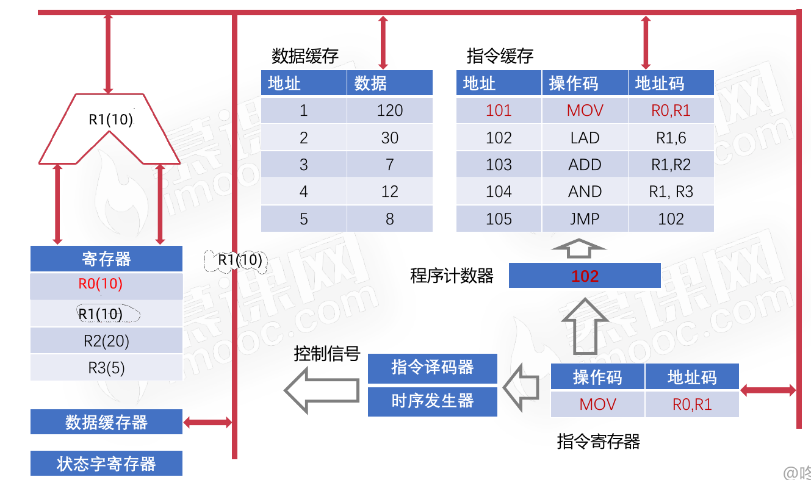
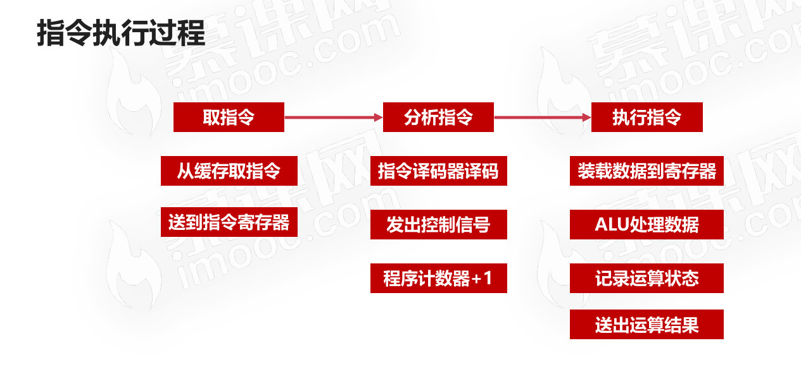

# 巩固习题&重要概念（笔试面试&巩固重点必备）

## 习题

1. 计算机的总线就像是计算机的“高速公路”，你是否可以说出总线主要的功能和分类？

   总线可以分为：片内总线、系统总线，其中系统总线可以分为数据总线、地址总线、控制总线。

2. 什么是总线标准，为什么需要总线标准，现在有哪些常见的总线标准？

   总线标准是系统与各模块、模块与模块之间的一个互连的标准界面。总线标准有利于各模块高效使用总线。USB、PCIe等。

3. 常说的“IO设备”，“I”、“O”分别是什么的缩写？

   Input、Output，输入设备、输出设备。

4. 常见的输入设备可以分为什么种类？

   字符输入设备（键盘等）、图像输入设备（鼠标、数位板、扫描仪）。

5. 常见的输出设备可以分为什么种类？

   主要是图像输出设备（显示器），但在计算机远未普及的时候，显示器属于字符输出设备。

6. 日常常见的计算机外设（显示器、键盘、鼠标、打印机），分别属于什么设备？

   显示器、打印机属于输出设备，键盘、鼠标属于输入设备。

7. 输入输出接口一般需要完成什么工作，可以把接口的线路分为什么线路？

   数据线、状态线、命令线、地址线。

8. DMA的全称是什么？

   DMA：Direct Memory Access，直接内存存取。

9. 程序中断和DMA相比，有什么优劣？

   程序中断和DMA都是计算机IO和低速设备的交互方式，程序中断方式实现简单，DMA方式效率更高。

10. 你是否可以清晰的表述计算机存储器的层次结构？存储器的层次结构是为了解决什么问题的？

    存储器的层次结构可以简单划分为：缓存-主存-辅存三个层次，缓存-主存主要是为了解决主存速度不够的问题；主存-辅存主要是为了解决主存容量不足的问题。

11. 什么是局部性原理，局部性原理对计算机存储系统的设计产生了什么影响？

    局部性原理是指CPU访问存储器时，无论是存取指令还是存取数据，所访问的存储单元都趋于聚集在一个较小的连续区域中。

12. 计算机存储系统的每一个层次分别有什么特点？

    缓存：速度快、位价高；主存：速度适中、位价适中；辅存：速度慢、位价低。

13. 计算机的辅助存储器一般是指计算机硬盘，你了解计算机磁盘的物理结构吗？

    

14. 磁盘的调度算法有哪些？分别有什么特点？

    先来先服务算法、最短寻道时间优先算法、扫描算法、循环扫描算法。

15. 计算机的主存一般是指计算机内存，内存有什么特点？

    主存容量比缓存大、比辅存小，访问速度比缓存慢，比辅存快，主存需要持续通电使用，停电时主存数据将会丢失。

16. 请解释概念：主存、辅存、Cache、RAM、ROM？

    主存：主存储器，即常说的计算机内存条，辅存：辅助存储器，即常说的磁盘、U盘、光盘、磁带等，Cache：高速缓存，即常说的L1、L2、L3缓存，CPU寄存器等，RAM：随机存取存储器（英语：Random Access Memory，缩写：RAM），ROM：只读存储器（Read Only Memory，缩写：ROM）。

17. 什么是字？什么是字块？

    字是指存放在一个存储单元中的二进制代码组合；字块是指存储在连续的存储单元中而被看作是一个单元的一组字。

18. 计算机的高速缓存一般是指Cache，Cache一般位于计算机的什么硬件设备上？

    在CPU上。

19. 一般使用什么指标去评估主存-高速缓存的性能？

    命中率。

20. 命中率是怎么定义的？

    

21. 访问效率是怎么定义的？

    

22. 假设CPU执行某段程序共计访问Cache命中4800次，访问主存200次，已知Cache的存取周期是30ns，主存的存取周期是150ns，求Cache-主存系统的平均访问时间和效率，试问该系统的性能提高了多少？

    平均访问时间：(4800*30+150*200)/5000=34.8ns，命中率：4800/5000*100%=96%，访问效率e：30/34.8*100%=86.2%，性能提升：(150-34.8)/150*100%=76.8%。

23. 请描述LFU、LRU、FIFO缓存置换算法的过程。

    * LFU
      * 
    * LRU
      * 
    * FIFO
      * 

24. 计算机的指令一般由操作码和地址码组成，那么计算机指令可以分类为几种类型？

    移位操作指令、数据传输指令、控制指令、算术逻辑操作指令。

25. 对计算机指令数据的寻址有哪几种方式？

    立即寻址、直接寻址、间接寻址。

26. 计算机的运算器主要由什么组成？控制器呢？

    控制器主要由：程序计数器、时序发生器、指令译码器、寄存器、总线组成。运算器主要由：数据缓冲器、ALU、寄存器、状态字寄存器、总线组成。

27. 请简述计算机指令的执行过程。

    指令执行过程开始之前

    

    制定执行过程完毕后

    上述指令执行过程示意图总结

    