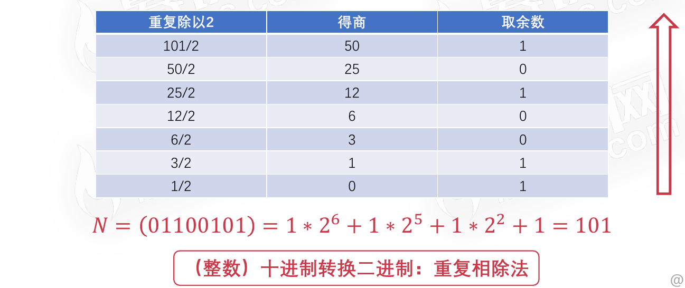
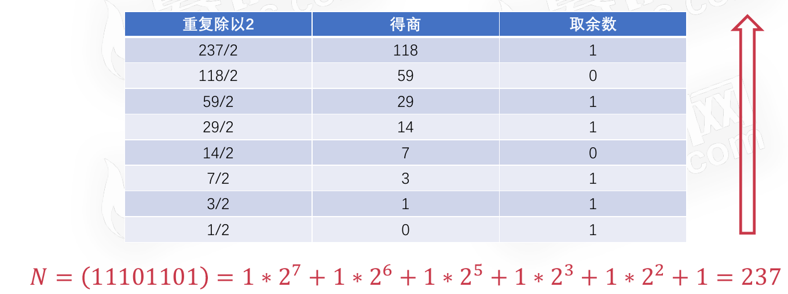
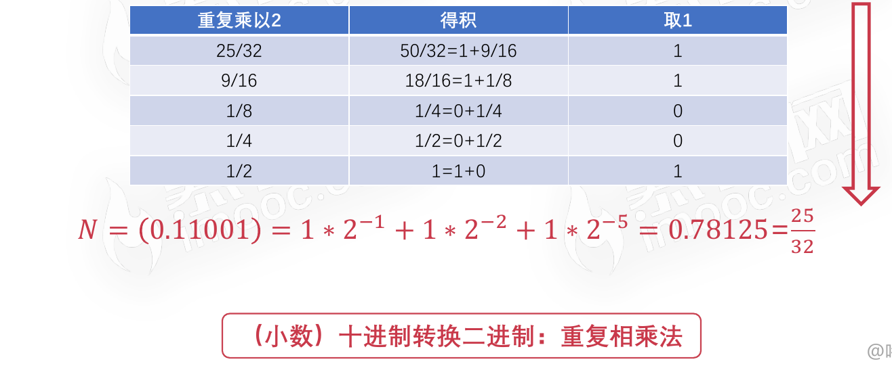
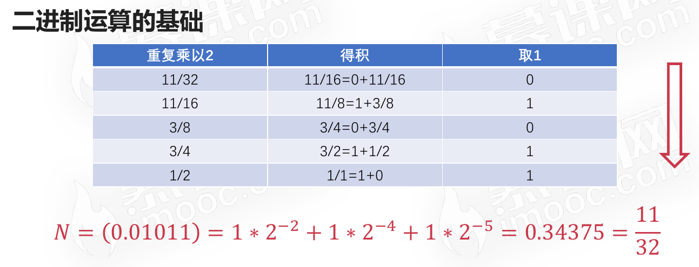

# 进制运算的基础

## 进制概述

### 进制的定义

* 进位制是一种记数方式,亦称进位计数法或位值计数法
* 有限种数字符号来表示无限的数值
* 使用的数字符号的数目称为这种进位制的基数或底数

### 常见的进制

* 二进制
  * Python表示法：`0b1000000000`
* 八进制
  * Python表示法：`0o2000`
* 十进制
* 十六进制
  * 由`[0-9]和A、B、C、D、E、F`组成
  * Python表示法：`0x400`
* 二十进制
  * 玛雅文明的玛雅数字
  * 因努伊特的因努伊特数字
* 六十进制
  * 时间、坐标、角度等量化数据

## 二进制运算的基础

对于正整数N，基数为r。

### 二进制转换十进制

#### 按权展开法

##### 二进制整数转十进制

计算方式为从右向左，数字(只计算数字1的，因为0和任何数相乘无意义都是0)所在位置从0开始累加。(任何数的0次方都是1)

N = 01100101 = 1 ∗ 26 + 1 ∗ 25 + 1 ∗ 22 + 1 ∗ 20 = 101

N = 11101101 = 1 ∗ 27 + 1 ∗ 26 + 1 ∗ 25 + 1 ∗ 23 + 1 ∗ 22 + 1 ∗ 20= 237

##### 二进制小数转十进制

计算方式为从左向右，数字(只计算数字1的，因为0和任何数相乘无意义都是0)所在位置从0开始累加(小数点不计位置)再取反。(任何数的0次方都是1)

N = 0.11001 = 1 ∗ 2−1 +1 ∗ 2−2 +1 ∗ 2−5 = 0.78125=25/32

N = 0.01011 = 1 ∗ 2−2 +1 ∗ 2−4 +1 ∗ 2−5 = 0.34375 =11/32

### 十进制转换二进制

#### 10进制整数101使用重复相除法转化为2进制过程

重复除以2，每除一次取余数记录下来，一直除到商为0为止。然后余数从下往上进行拼接，得到的二进制数的位数不足8位的在前边用0补齐到8位。

#### 10进制小数25/32使用重复相乘法转换为2进制过程

每次数字重复乘于2(其实是分子*2)，将每次得到的乘积化为真分数(真分数的特点是“分母大于分子”)，取其中的1或0保存，直至最后数字的值为1时停止。

然后将每次保存的1和0从上往下依次拼接，再在前边加上小数点和0即可。

