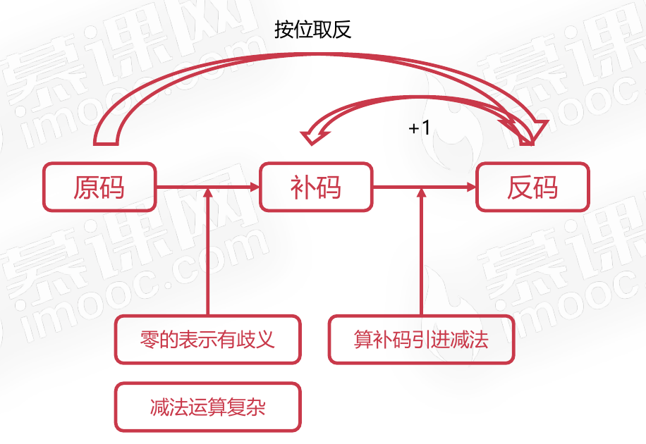

# 有符号数与无符号数

## 二进制原码表示法

* 使用0表示正数、1表示负数
* 规定符号位位于数值第一位
* 表达简单明了,是人类最容易理解的表示法
* 
* 

## 二进制原码表示法的缺点

原码进行运算非常复杂,特别是两个操作数符号不同的时候

* 需要先判断两个操作数绝对值大小
* 使用绝对值大的数减去绝对值小的数
* 对于符号值,以绝对值大的为准

## 二进制补码表示法

## 二进制的反码表示法

### 引进反码的目的

* 减法运算复杂,希望找到使用正数替代负数的方法
* 使用加法代替减法操作,从而消除减法

反码的目的是找出原码和补码之间的规律,消除转换过程中的减法。

### 反码的定义

## 二进制原码、补码、反码之间的规律

## 小数的补码

### 小数的原码、补码与反码之间的规律与整数的规律一致

