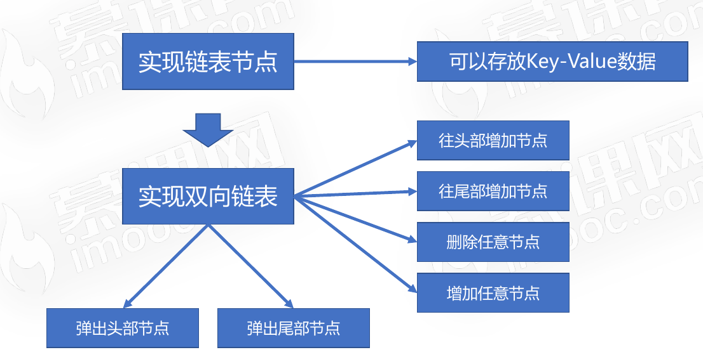
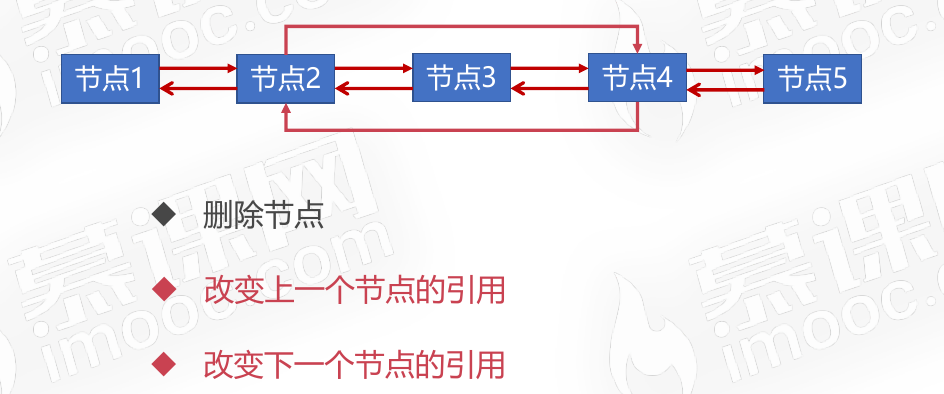
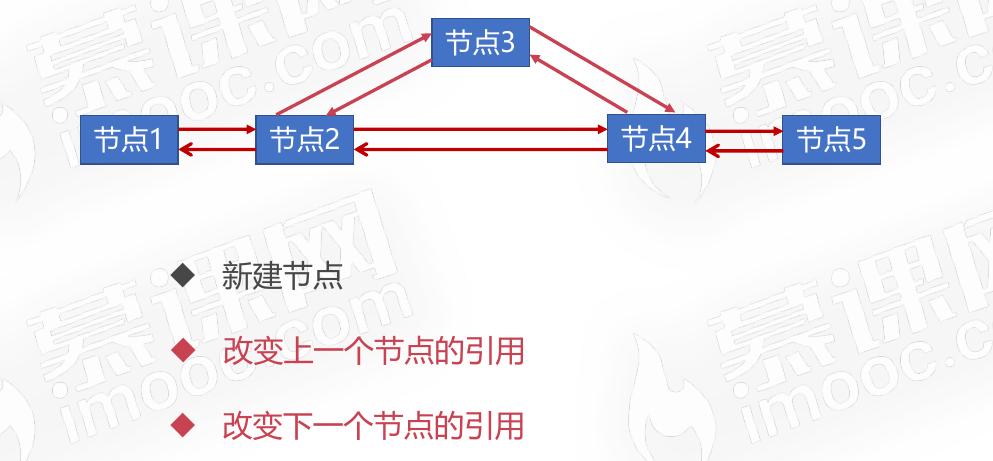

# 双向链表的原理与实践





## 往头部增加节点


## 往尾部增加节点


## 删除任意节点



## 增加任意节点



## 弹出头部节点


## 弹出尾部节点


## 代码实现

```python
#! -*- encoding=utf-8 -*-


class Node:
    def __init__(self, key, value):
        self.key = key
        self.value = value
        self.prev = None
        self.next = None

    def __str__(self):
        val = '{%d: %d}' % (self.key, self.value)
        return val

    def __repr__(self):
        val = '{%d: %d}' % (self.key, self.value)
        return val


class DoubleLinkedList:
    def __init__(self, capacity=0xffff):
        self.capacity = capacity
        self.head = None
        self.tail = None
        self.size = 0

    # 从头部添加
    def __add_head(self, node):
        if not self.head:
            self.head = node
            self.tail = node
            self.head.next = None
            self.head.prev = None
        else:
            node.next = self.head
            self.head.prev = node
            self.head = node
            self.head.prev = None
        self.size += 1
        return node

    # 从尾部添加
    def __add_tail(self, node):
        if not self.tail:
            self.tail = node
            self.head = node
            self.tail.next = None
            self.tail.prev = None
        else:
            self.tail.next = node
            node.prev = self.tail
            self.tail = node
            self.tail.next = None
        self.size += 1
        return node

    # 从尾部删除
    def __del_tail(self):
        if not self.tail:
            return
        node = self.tail
        if node.prev:
            self.tail = node.prev
            self.tail.next = None
        else:
            self.tail = self.head = None
        self.size -= 1
        return node

    # 从头部删除
    def __del_head(self):
        if not self.head:
            return
        node = self.head
        if self.head.next:
            self.head.next.prev = None
            self.head = self.head.next
        else:
            self.head = self.tail = None
        self.size -= 1
        return node

    # 任意节点删除
    def __remove(self, node):
        # 如果node=None, 默认删除尾部节点
        if not node:
            node = self.tail
        if node == self.tail:
            self.__del_tail()
        elif node == self.head:
            self.__del_head()
        else:
            node.prev.next = node.next
            node.next.prev = node.prev
            self.size -= 1
        return node

    def pop(self):
        return self.__del_head()

    def append(self, node):
        return self.__add_tail(node)

    def append_front(self, node):
        return self.__add_head(node)

    def remove(self, node=None):
        return self.__remove(node)

    def print(self):
        p = self.head
        line = ''
        while p:
            line += '%s' % (p)
            p = p.next
            if p:
                line += '->'
        print(line)


if __name__ == '__main__':
    l = DoubleLinkedList(10)
    nodes = []
    for i in range(10):
        node = Node(i, i)
        nodes.append(node)

    l.append(nodes[0])
    l.print()
    l.append(nodes[1])
    l.print()
    l.pop()
    l.print()
    l.append(nodes[2])
    l.print()
    l.append_front(nodes[3])
    l.print()
    l.append(nodes[4])
    l.print()
    l.remove(nodes[2])
    l.print()
    l.remove()
    l.print()
```