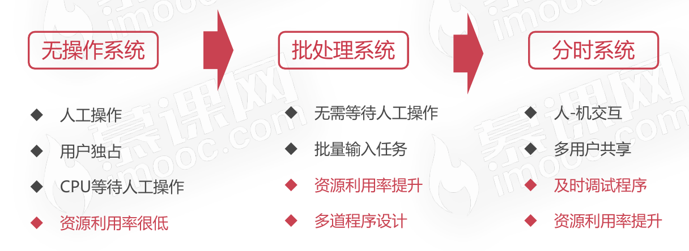
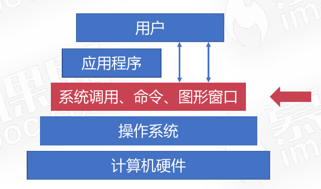
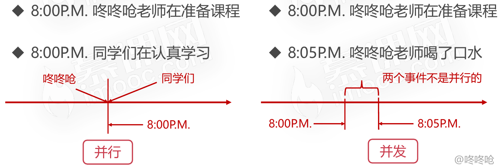

# 操作系统概览

## 操作系统的演进

## 多道程序设计

早期批处理系统只能一次处理一个任务，多道程序设计使得批处理系统可以一次处理多个任务。

### 对多道程序的管理是操作系统的重要功能

* 多道程序设计是指在计算机内存中同时存放多个程序
* 多道程序在计算机的管理程序之下相互穿插运行

## 操作系统的五大功能

* 进程管理
  * 进程管理之进程实体
  * 进程管理之五状态模型
  * 进程管理之进程同步
  * Linux的进程管理
* 文件管理
  * 操作系统的文件管理
  * Linux的文件系统
  * Linux文件的基本操作
* 存储管理
  * 存储管理之内存分配与回收
  * 存储管理之段页式存储管理
  * 存储管理之虚拟内存
  * Linux的存储管理
* 设备管理
  * 操作系统的设备管理
* 作业管理
  * 作业管理之进程调度
  * 作业管理之死锁

## 操作系统是什么

**操作系统是管理硬件、提供用户交互的软件系统。**

* 操作系统是管理计算机硬件和软件资源的计算机程序
* 管理配置内存、决定资源供需顺序、控制输入输出设备等
* 操作系统提供让用户和系统交互的操作界面
* 操作系统的种类是多种多样的,不局限于计算机
* 从手机到超级计算机,操作系统可简单也可复杂
* 在不同的设备上,操作系统可向用户呈现多种操作手段
* 适用于移动设备的操作系统Android和iOS
  * 
* 适用于PC端的操作系统Windows、Linux、macOS Sierra
  * 

## 为什么需要操作系统

* 我们不可能直接操作计算机硬件
* 设备种类繁多复杂,需要统一界面
* 操作系统的简易性使得更多人能够使用计算机

## 操作系统的基本功能

* 操作系统统一管理着计算机资源
  * 
* 操作系统实现了对计算机资源的抽象
  * 
* 操作系统提供了用户与计算机之间的接口
  * 
  * 

## 操作系统相关概念

### 并发性

#### 并发与并行的概念

* 并行是指两个或多个事件可以在同一个时刻发生
* 并发是指两个或多个事件可以在同一个时间间隔发生

### 共享性

共享性表现为操作系统中的资源可供多个并发的程序共同使用，这种共同使用的形式称之为资源共享。

#### 互斥共享形式

* 当资源被程序A占用时,其他想使用的话只能等待
* 只有进程A使用完以后,其他进程才可以使用该资源

#### 同时访问形式

* 某种资源在一段时间内并发地被多个程序访问
* 这种“同时”是宏观的,从宏观去看该资源可以被同时访问

### 虚拟性

* 虚拟性表现为把一个物理实体转变为若干个逻辑实体
* 物理实体是真实存在的,逻辑实体是虚拟的
* 虚拟的技术主要有时分复用技术和空分复用技术

#### 时分复用技术

* 资源在时间上进行复用,不同程序并发使用
* 多道程序分时使用计算机的硬件资源
* 提高资源的利用率

#### 空分复用技术

* 空分复用技术用来实现虚拟磁盘、虚拟内存等
* 提高资源的利用率,提升编程效率

### 异步性

* 在多道程序环境下,允许多个进程并发执行
* 进程在使用资源时可能需要等待或放弃
* 进程的执行并不是一气呵成的,而是以走走停停的形式推进

