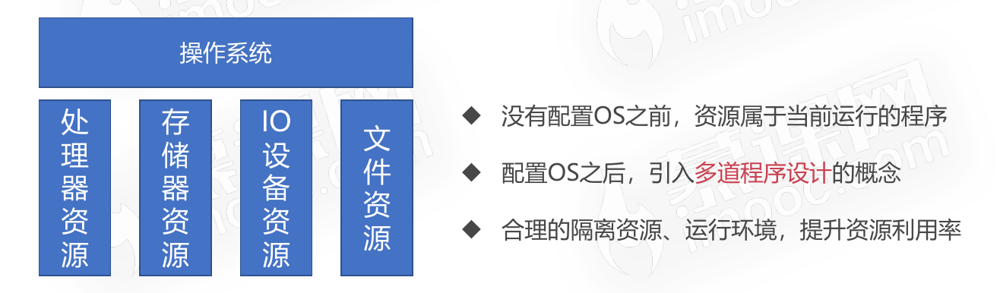
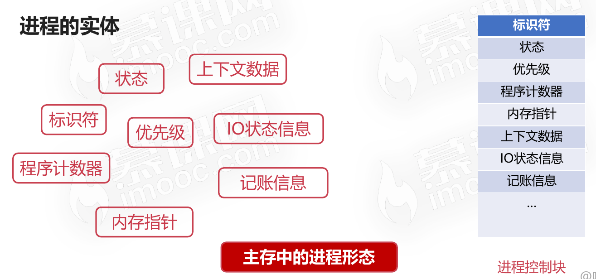
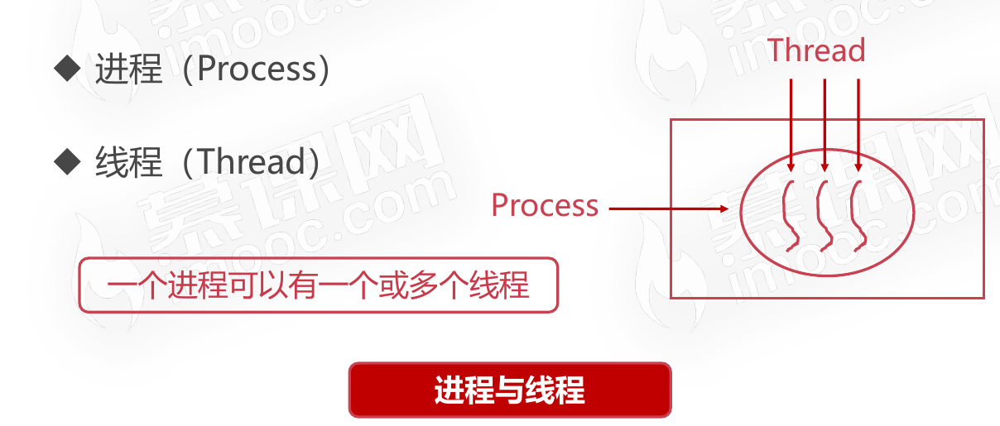
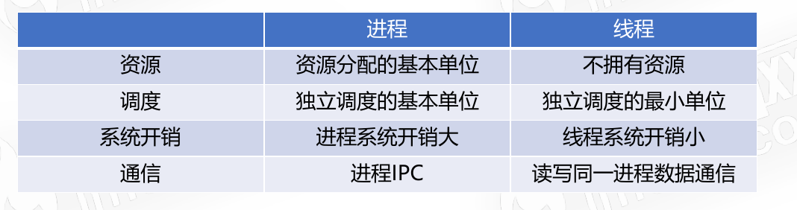

# 进程管理之进程实体

## 为什么需要进程

* 进程是系统进行资源分配和调度的基本单位
* 进程作为程序独立运行的载体保障程序正常执行
* 进程的存在使得操作系统资源的利用率大幅提升

## 进程的实体

### 主存中的进程形态

* 标识符唯一标记一个进程,用于区别其他进程
* 状态标记进程的进程状态,如:运行态
* 程序计数器指向进程即将被执行的下一条指令的地址
* 内存指针指的是程序代码、进程数据相关指针
* 上下文数据指的是进程执行时处理器存储的数据
* IO状态信息指的是被进程IO操作所占用的文件列表
* 记账信息指的是使用处理器时间、时钟数总和等

### 进程控制块(PCB)

* 用于描述和控制进程运行的通用数据结构
* 记录进程当前状态和控制进程运行的全部信息
* PCB的使得进程是能够独立运行的基本单位
* PCB是操作系统进行调度经常会被读取的信息
* PCB是常驻内存的,存放在系统专门开辟的PCB区域内

## 进程与线程

### 进程与线程之间的关系

* 进程是系统进行资源分配和调度的基本单位，线程是操作系统进行运行调度的最小单位。
* 线程包含在进程之中,是进程中实际运行工作的单位。
* 一个进程可以并发多个线程,每个线程执行不同的任务。
* 进程中的所有线程共享进程的资源。

### 进程与线程之间的区别

