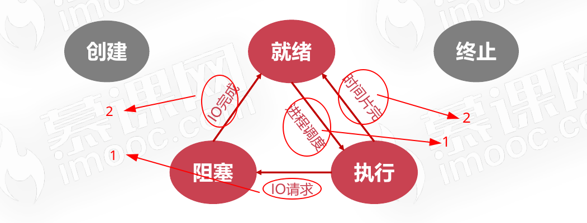
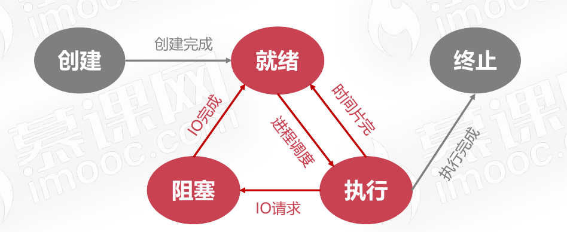

# 进程管理之五状态模型

进程的五状态模型分别为：创建、就绪、阻塞、执行、终止这5种状态。

## 创建状态

## 就绪状态

* 当进程被分配到除CPU以外所有必要的资源后
* 只要再获得CPU的使用权,就可以立即运行
* 其他资源都准备好、只差CPU资源的状态为就绪状态

### 就绪队列

在一个系统中多个处于就绪状态的进程通常排成一个队列。这个队列叫做就绪队列。

## 执行状态

* 进程获得CPU,其程序正在执行称为执行状态
* 在单处理机中,在某个时刻只能有一个进程是处于执行状态

## 阻塞状态

* 进程因某种原因如:其他设备未就绪而无法继续执行
* 从而放弃CPU的状态称为阻塞状态

### 阻塞队列

在一个系统中多个处于阻塞状态的进程通常排成一个队列。这个队列叫做阻塞队列。

## 就绪、阻塞、执行三状态切换关系示意图

## 终止状态

## 进程的五状态模型示意图

