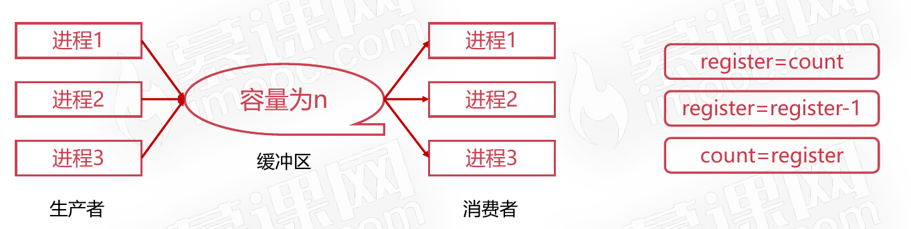
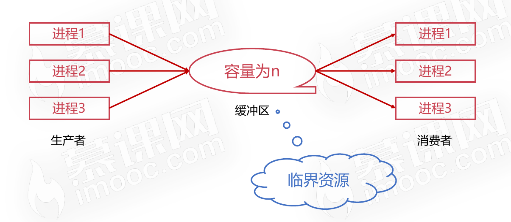

# 进程管理之进程同步

## 为什么需要进程间同步

### 生产者-消费者问题

有一群生产者进程在生产产品,并将这些产品提供给消费者进程进行消费,生产者进程和消费者进程可以并发执行,在两者之间设置了一个具有n可缓冲区的缓冲池,生产者进程需要将所生产的产品放到一个缓冲区中,消费者进程可以从缓冲区取走产品消费。

生产者生产了一个产品

消费者消费了一个产品

单从生产者程序或消费者程序去看是没问题的，但是当两者并发执行时就可能出差错。

生产者生产了一个商品，消费者消费了一个商品后，临界资源的值应该还是跟之前生产者生产产品之前的数量一致才对。

### 哲学家进餐问题

有五个哲学家,他们的生活方式是交替地进行思考和进餐,哲学家们共同使用一张圆桌,分别坐在周围的五张椅子上,在圆桌上有五个碗和五支筷子。平时哲学家们只进行思考,饥饿时则试图取靠近他们的左、右两支筷子,只有两支筷子都被他拿到的时候就能进餐,进餐完毕之后,放下左右筷子继续思考。

### 为什么需要进程间同步

* 根源问题是:彼此相互之间没有通信
* “如果生产者通知消费者我已经完成一件生产”
* “哲学家向旁边哲学家说我要进餐了”
* 对竞争资源在多进程间进行使用次序的协调
* 使得并发执行的多个进程之间可以有效使用资源和相互合作

## 进程间同步的原则

### 什么是临界资源

临界资源指的是一些虽作为共享资源却又无法同时被多个线程共同访问的共享资源。当有进程在使用临界资源时,其他进程必须依据操作系统的同步机制等待占用进程释放该共享资源才可重新竞争使用共享资源。

### 进程间同步四原则

1. 空闲让进:资源无占用,允许使用
2. 忙则等待:资源有占用,请求进程等待
3. 有限等待:保证有限等待时间能够使用资源
4. 让权等待:等待时,进程需要让出CPU

### 进程间的同步的方法

* 消息队列
* 共享存储
* 信号量

## 线程同步

### 线程间的同步的方法

* 互斥量
* 读写锁
* 自旋锁
* 条件变量