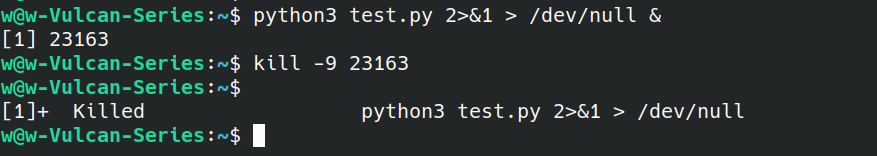

# Linux的进程管理

## Linux进程的相关概念

### 进程的类型

1. 前台进程
   * 前台进程就是具有终端,可以和用户交互的进程
   * 前台进程占用终端时，用户不能做其他操作。
   * 
   * 
2. 后台进程
   * 与前台进程相对,没有占用终端的就是后台进程
   * 后台程序基本上不和用户交互,优先级比前台进程低
   * 如何启动一个后台进程：将需要执行的命令以“&”符号结束即可
   * 
   * 
   * 杀死后台进程：kill -9 进程PID
     * 
3. 守护进程
   * 守护(daemon)进程是特殊的后台进程
   * 很多守护进程在系统引导的时候启动,一直运行直到系统关闭
   * Linux有很多典型的守护进程：进程名字以“d”结尾的一般都是守护进程
     * 

### 进程的标记

#### 进程ID

* 进程ID是进程的唯一标记,每个进程拥有不同的ID
* 进程ID表现为一个非负整数,最大值由操作系统限定
* 操作系统提供fork函数接口创建进程
  * 
  * 

* 父子进程关系可以通过pstree命令查看

  * ```bash
    w@w-Vulcan-Series:~$ pstree
    systemd─┬─DiscoverNotifie───3*[{DiscoverNotifie}]
            ├─ModemManager───2*[{ModemManager}]
            ├─NetworkManager───2*[{NetworkManager}]
            ├─accounts-daemon───2*[{accounts-daemon}]
            ├─acpid
            ├─agent───2*[{agent}]
            ├─at-spi-bus-laun─┬─dbus-daemon
            │                 └─3*[{at-spi-bus-laun}]
            ├─at-spi2-registr───2*[{at-spi2-registr}]
            ├─avahi-daemon───avahi-daemon
            ├─baidu-qimpanel───4*[{baidu-qimpanel}]
            ├─baloo_file───{baloo_file}
            ├─bd-qimpanel.wat───sleep
            ├─bluetoothd
            ├─clash-linux-amd───12*[{clash-linux-amd}]
            ├─containerd───17*[{containerd}]
            ├─cron
            ├─cups-browsed───2*[{cups-browsed}]
            ├─cupsd
            ├─2*[dbus-daemon]
            ├─dockerd───16*[{dockerd}]
            ├─fcitx───3*[{fcitx}]
            ├─fcitx-dbus-watc
            ├─flameshot───2*[{flameshot}]
            ├─fwupd───4*[{fwupd}]
            ├─gmenudbusmenupr───2*[{gmenudbusmenupr}]
            ├─haveged
            ├─irqbalance───{irqbalance}
            ├─kdeconnectd───3*[{kdeconnectd}]
            ├─kdeinit5─┬─2*[file.so]
            │          ├─kaccess───2*[{kaccess}]
            │          ├─kded5───6*[{kded5}]
            │          └─klauncher───2*[{klauncher}]
            ├─2*[kerneloops]
            ├─kio_http_cache_───{kio_http_cache_}
            ├─ksmserver─┬─kwin_x11───7*[{kwin_x11}]
            │           └─2*[{ksmserver}]
            ├─latte-dock─┬─Typora─┬─Typora───Typora─┬─Typora
            │            │        │                 └─6*[{Typora}]
            │            │        ├─Typora───Typora
            │            │        ├─Typora───4*[{Typora}]
            │            │        ├─Typora───23*[{Typora}]
            │            │        └─39*[{Typora}]
            │            ├─chrome─┬─2*[cat]
            │            │        ├─chrome───chrome─┬─chrome
            │            │        │                 └─7*[{chrome}]
            │            │        ├─chrome─┬─chrome─┬─chrome───4*[{chrome}]
            │            │        │        │        ├─7*[chrome───12*[{chrome}]]
            │            │        │        │        ├─chrome───16*[{chrome}]
            │            │        │        │        └─chrome───11*[{chrome}]
            │            │        │        └─nacl_helper
            │            │        ├─2*[chrome───6*[{chrome}]]
            │            │        └─24*[{chrome}]
            │            ├─code─┬─code───code───6*[{code}]
            │            │      ├─code
            │            │      ├─code───5*[{code}]
            │            │      ├─code─┬─bash
            │            │      │      ├─code─┬─2*[code───7*[{code}]]
            │            │      │      │      └─17*[{code}]
            │            │      │      ├─code───11*[{code}]
            │            │      │      └─26*[{code}]
            │            │      ├─code───25*[{code}]
            │            │      └─32*[{code}]
            │            ├─dolphin─┬─okular───2*[{okular}]
            │            │         └─3*[{dolphin}]
            │            ├─konsole─┬─bash───pstree
            │            │         └─2*[{konsole}]
            │            └─7*[{latte-dock}]
            ├─networkd-dispat
            ├─nvidia-persiste
            ├─org_kde_powerde───4*[{org_kde_powerde}]
            ├─plasmashell───8*[{plasmashell}]
            ├─polkit-kde-auth───4*[{polkit-kde-auth}]
            ├─polkitd───2*[{polkitd}]
            ├─rsyslogd───3*[{rsyslogd}]
            ├─rtkit-daemon───2*[{rtkit-daemon}]
            ├─sddm─┬─Xorg───5*[{Xorg}]
            │      ├─sddm-helper───startplasma-x11─┬─fcitx
            │      │                               ├─plasma_session───{plasma_session}
            │      │                               ├─ssh-agent
            │      │                               └─{startplasma-x11}
            │      └─{sddm}
            ├─snapd───22*[{snapd}]
            ├─sogoupinyinServ───6*[{sogoupinyinServ}]
            ├─sogoupinyinServ───2*[{sogoupinyinServ}]
            ├─sshd
            ├─start_kdeinit
            ├─systemd─┬─(sd-pam)
            │         ├─dbus-daemon
            │         ├─dconf-service───2*[{dconf-service}]
            │         ├─gnome-keyring-d───3*[{gnome-keyring-d}]
            │         ├─kactivitymanage───5*[{kactivitymanage}]
            │         ├─kglobalaccel5───2*[{kglobalaccel5}]
            │         ├─kscreen_backend───2*[{kscreen_backend}]
            │         ├─obexd
            │         └─pulseaudio───3*[{pulseaudio}]
            ├─systemd-journal
            ├─systemd-logind
            ├─systemd-resolve
            ├─systemd-timesyn───{systemd-timesyn}
            ├─systemd-udevd
            ├─thermald───{thermald}
            ├─udisksd───4*[{udisksd}]
            ├─unattended-upgr───{unattended-upgr}
            ├─upowerd───2*[{upowerd}]
            ├─vpnagentd───4*[{vpnagentd}]
            ├─whoopsie───2*[{whoopsie}]
            ├─wpa_supplicant
            ├─xembedsniproxy───2*[{xembedsniproxy}]
            └─xsettingsd
    w@w-Vulcan-Series:~$ 
    ```

* ID为0的进程为idle进程,是系统创建的第一个进程

* ID为1的进程为init进程,是0号进程的子进程,完成系统初始化

* Init进程是所有用户进程的祖先进程

#### 进程的状态标记


## 操作Linux进程的相关命令

### ps命令

* ps命令常用于显示当前进程的状态
* ps命令常配合aux参数或ef参数和grep命令检索特定进程

#### 查看某个用户的进程

* 查看root用户的进程

  * ```bash
    w@w-Vulcan-Series:~$ ps -u root
        PID TTY          TIME CMD
          1 ?        00:00:01 systemd
          2 ?        00:00:00 kthreadd
          3 ?        00:00:00 rcu_gp
          4 ?        00:00:00 rcu_par_gp
          6 ?        00:00:00 kworker/0:0H-kblockd
          7 ?        00:00:00 kworker/0:1-memcg_kmem_cache
          9 ?        00:00:00 mm_percpu_wq
         10 ?        00:00:00 ksoftirqd/0
         11 ?        00:00:04 rcu_sched
         12 ?        00:00:00 migration/0
         13 ?        00:00:00 idle_inject/0
         14 ?        00:00:00 cpuhp/0
         15 ?        00:00:00 cpuhp/1
         16 ?        00:00:00 idle_inject/1
         17 ?        00:00:00 migration/1
         18 ?        00:00:00 ksoftirqd/1
    ```

* 查看w用户的进程

  * ```bash
    w@w-Vulcan-Series:~$ ps -u w
        PID TTY          TIME CMD
       1510 ?        00:00:00 systemd
       1511 ?        00:00:00 (sd-pam)
       1529 ?        00:01:13 pulseaudio
       1552 ?        00:00:09 dbus-daemon
       1555 ?        00:00:00 startplasma-x11
       1610 ?        00:00:00 ssh-agent
       1625 ?        00:00:00 fcitx <defunct>
       1627 ?        00:00:09 fcitx
       1633 ?        00:00:03 dbus-daemon
       1638 ?        00:00:00 fcitx-dbus-watc
       1660 ?        00:00:00 start_kdeinit
       1661 ?        00:00:00 kdeinit5
       1663 ?        00:00:03 klauncher
       1666 ?        00:00:06 kded5
       1681 ?        00:00:26 sogoupinyinServ
       1695 ?        00:00:03 kglobalaccel5
       1697 ?        00:00:03 kaccess
       1700 ?        00:00:00 plasma_session
       1708 ?        00:00:03 ksmserver
    ```

#### 查看特定的进程

```bash
w@w-Vulcan-Series:~$ ps -aux | grep python3
root         891  0.0  0.1  34968 18056 ?        Ss   10:05   0:00 /usr/bin/python3 /usr/bin/networkd-dispatcher --run-startup-triggers
root        1131  0.0  0.1 113552 20764 ?        Ssl  10:05   0:00 /usr/bin/python3 /usr/share/unattended-upgrades/unattended-upgrade-shutdown --wait-for-signal
w          31878  0.0  0.0  12104   736 pts/1    S+   12:29   0:00 grep --color=auto python3
```

#### 按照CPU使用率对进程进行排序

```bash
w@w-Vulcan-Series:~$ ps -aux --sort=-pcpu
USER         PID %CPU %MEM    VSZ   RSS TTY      STAT START   TIME COMMAND
w           3564 20.6  3.2 9641896 535652 ?      Sl   10:09  29:22 /opt/google/chrome/chrome --type=renderer --field-trial-handle=2522754366762656096,59331080
w           1720  7.7  2.6 3383048 439732 ?      Sl   10:05  11:16 /usr/bin/kwin_x11 -session 1017914818f155000160611942600000013910023_1610638103_527373
w           2663  7.7  1.5 764216 247220 ?       Sl   10:06  11:14 /opt/google/chrome/chrome --type=gpu-process --field-trial-handle=2522754366762656096,59331
root        1141  3.9  1.0 710344 177048 tty1    Ssl+ 10:05   5:50 /usr/lib/xorg/Xorg -nolisten tcp -auth /var/run/sddm/{c51b340f-41cd-4a55-9001-2c711bde3fb7}
w           1723  2.6  2.1 1585996 348672 ?      Sl   10:05   3:53 /usr/bin/plasmashell
w          11060  2.6  4.3 9529464 705380 ?      Sl   10:22   3:26 /usr/share/typora/Typora --type=renderer --field-trial-handle=17227025185449257074,40827533
w           2619  1.4  2.0 1081364 334180 ?      Sl   10:06   2:02 /opt/google/chrome/chrome
w          10862  1.0  2.3 742648 389932 ?       Sl   10:21   1:21 /usr/bin/okular /home/w/CS-Notes/计算机基础/imooc-recourse/ppt/6. 操作系统基础��
w          11045  1.0  0.9 429172 159064 ?       Sl   10:22   1:24 /usr/share/typora/Typora --type=gpu-process --field-trial-handle=17227025185449257074,40827
w           1529  0.9  0.1 1411840 19324 ?       S<sl 10:05   1:19 /usr/bin/pulseaudio --daemonize=no --log-target=journal
w          11007  0.9  1.1 5395948 180700 ?      Sl   10:22   1:11 /usr/share/typora/Typora
root        1165  0.8  0.0      0     0 ?        S    10:05   1:11 [irq/152-nvidia]
w           1762  0.8  1.5 1200484 246148 ?      Sl   10:05   1:13 /usr/bin/latte-docks
```

#### 按照MEM使用率对进程进行排序

```bash
w@w-Vulcan-Series:~$ ps -aux --sort=-pmem
USER         PID %CPU %MEM    VSZ   RSS TTY      STAT START   TIME COMMAND
w          11060  2.6  4.3 9531512 710468 ?      Sl   10:22   3:29 /usr/share/typora/Typora --type=renderer --field-trial-handle=17227025185449257074,40827533
w           3564 20.5  2.8 9591120 469796 ?      Sl   10:09  29:27 /opt/google/chrome/chrome --type=renderer --field-trial-handle=2522754366762656096,59331080
w           1720  7.7  2.5 3328392 410968 ?      Sl   10:05  11:22 /usr/bin/kwin_x11 -session 1017914818f155000160611942600000013910023_1610638103_527373
w          10862  1.0  2.3 742648 389932 ?       Sl   10:21   1:21 /usr/bin/okular /home/w/CS-Notes/计算机基础/imooc-recourse/ppt/6. 操作系统基础��
w           1723  2.6  2.1 1585996 348480 ?      Sl   10:05   3:56 /usr/bin/plasmashell
w           2619  1.4  2.0 1076244 331060 ?      Sl   10:06   2:03 /opt/google/chrome/chrome
w           1762  0.8  1.5 1200484 246216 ?      Sl   10:05   1:17 /usr/bin/latte-dock
w           3036  0.1  1.3 4767832 222224 ?      Sl   10:07   0:15 /opt/google/chrome/chrome --type=renderer --field-trial-handle=2522754366762656096,59331080
w           2663  7.7  1.2 741116 200972 ?       Sl   10:06  11:16 /opt/google/chrome/chrome --type=gpu-process --field-trial-handle=2522754366762656096,59331
w           1666  0.0  1.2 1307084 197700 ?      Sl   10:05   0:07 kded5
w          11007  0.9  1.1 5461516 180500 ?      Sl   10:22   1:13 /usr/share/typora/Typora
root        1141  4.0  1.0 710340 177040 tty1    Ssl+ 10:05   5:54 /usr/lib/xorg/Xorg -nolisten tcp -auth /var/run/sddm/{c51b340f-41cd-4a55-9001-2c711bde3fb7}
w           2919  0.0  1.0 4744568 163312 ?      Sl   10:07   0:05 /opt/google/chrome/chrome --type=renderer --field-trial-handle=2522754366762656096,59331080
w          11045  1.0  0.9 429172 162704 ?       Sl   10:22   1:25 /usr/share/typora/Typora --type=gpu-process --field-trial-handle=17227025185449257074,40827
w           1681  0.3  0.9 960244 158528 ?       Sl   10:05   0:28 /opt/sogoupinyin/files/bin/sogoupinyinService
w           1878  0.2  0.7 407788 114888 ?       Sl   10:05   0:21 /usr/bin/flameshot
```

### fg命令

fg命令将一个后台命令调换至前台终端继续执行。

* 
* 场景2：当你vim一个文件是，如果需要用shell执行别的操作，但是你又不打算关闭vim，因为你得存盘退出vim，你可以简单的按下Ctrl+z，shell会将vim进程挂起~，当你结束了那个shell操作之后，你可以用fg命令继续vim你的文件。
  * 

### bg命令

bg命令将一个后台暂停的命令变成继续执行


### Ctrl + c命令

中断命令。强制中断程序的执行。


### Ctrl + d命令

在shell中，ctrl-d表示推出当前shell窗口。

### Ctrl + z命令

中断命令。将任务中断，但是此任务并没有结束，他仍然在进程中，只不过是维持挂起的状态。

通过fg命令将ping命令调换至前台继续执行。


### jobs命令

查看当前有多少在后台运行的命令


可以使用`kill -9 %jobId`来杀死对应的在后台运行的命令。


### nohup命令

* 不挂断地运行命令
  * 

### top命令


#### 第1行系统相关信息

* 系统当前时间：12:40:17
* 系统已经运行了多长时间：up 2:35
* 当前登录用户数：3users
* load average：系统平均负载，分别是系统运行1min、5min、15min的负载情况，每隔5s检查一次活跃进程数，然后按特定算法算出当前数值，如果`这个数除以逻辑CPU数量>5`，那么表明系统现在处于**超负荷运转**。

#### 第2行task进程相关信息

* total：总进程个数
* running：运行中的进程个数
* sleeping：休眠的进程个数
* stopped：停止状态的进程个数
* zombie：僵尸进程的个数

#### 第3行CPU状态相关信息

* us：用户空间CPU占用百分比
* sy：内核空间CPU占用百分比
* ni：用户进程空间内改变过优先级进程的CPU占用百分比
* id：空闲CPU百分比
* wa：IO等待CPU占用百分比
* hi：硬中断
* si：软中断

#### 第4行内存状态相关信息

可用内存 = free + buff + cached

* total：所有内存大小(Mib)
* free：空闲内存大小
* used：已经使用了的内存的大小
* buff/cache：缓存占用内存大小

#### 第5行swap内存交换分区状态相关信息

* avail Mem：缓冲的交换区总量
* 对于内存监控，如果swap交换分区的used不断在变化，说明内核在不断进行内存和swap的数据交换，这说明内存不够用了。

#### 第7行进程相关信息

- PID：进程号(唯一)
- USER：进程所有者
- PR：进程优先级
- NI：负值表示高优先级，正值表示低优先级
- VIRT：进程使用的虚拟内存总量，单位kb，VIRT=SWAP+RES
- RES：进程使用的、未被换出的物理内存大小，单位kb，RES=CODE+DATA
- SHR：共享内存
- S：进程状态。
  - R：(TASK_RUNNING),进程正处于运行状态
  - S：(TASK_INTERRUPTIBLE),进程正处于睡眠状态
  - D：(TASK_UNINTERRUPTIBLE),进程正在处于IO等待的睡眠状态
  - T：(TASK_STOPPED),进程正处于暂停状态
  - Z：(TASK_DEAD or EXIT_ZOMBIE),进程正处于退出状态,或僵尸进程
- %CPU：上次更新到现在进程的CPU时间占用百分比
- %MEN：进程使用的物理内存百分比
- TIME+：进程使用的CPU时间总计
- COMMAND：进程的命令

### kill命令

* kill命令发送指定信号给进程
* kill –l 可以查看操作系统支持的信号
  * 
* 只有(SIGKILL 9)信号可以无条件终止进程，其他信号进程有权忽略。
* 杀死正在运行的进程
  * 