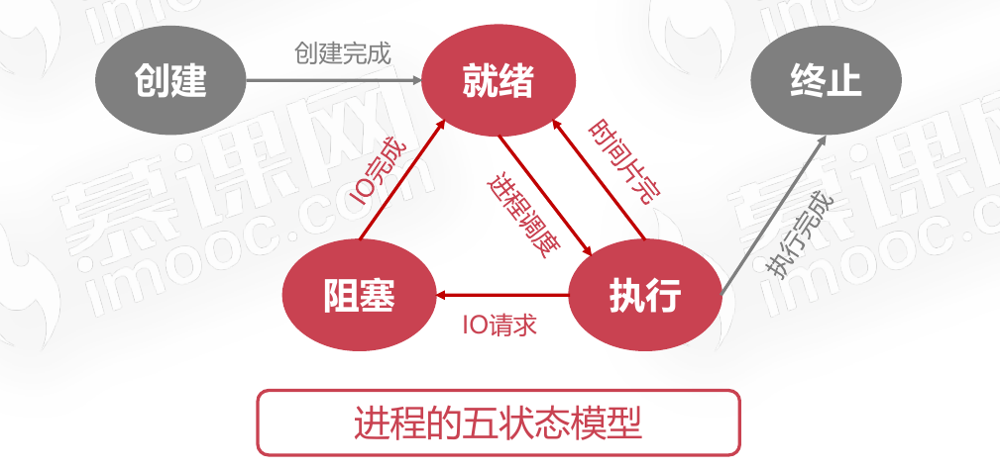
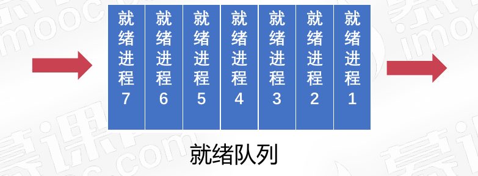
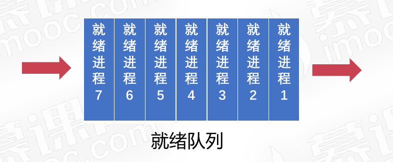
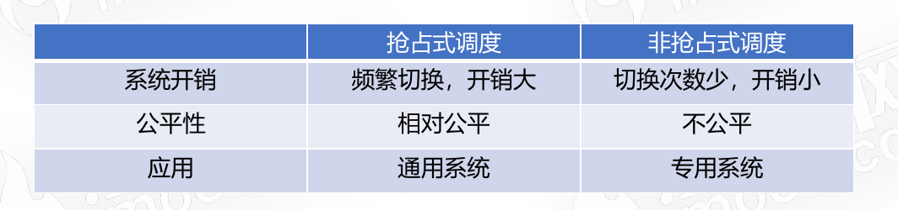
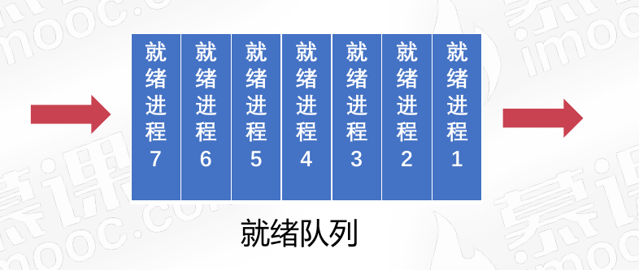

# 作业管理之进程调度

## 进程调度概述

进程调度是指计算机通过决策决定哪个就绪进程可以获得CPU使用权。

* 保留旧进程的运行信息,请出旧进程(收拾包袱)
* 选择新进程,准备运行环境并分配CPU(新进驻)

### 进程调度的三大机制

#### 就绪队列的排队机制

将就绪进程按照一定的方式排成队列,以便调度程序可以最快找到就绪进程.

#### 选择运行进程的委派机制

调度程序以一定的策略选择就绪进程,将CPU资源分配给它.

#### 新老进程的上下文切换机制

保存当前进程的上下文信息,装入被委派执行进程的运行上下文。

### 进程调度的方法

#### 非抢占式的调度

* 处理器一旦分配给某个进程,就让该进程一直使用下去
* 调度程序不以任何原因抢占正在被使用的处理器
* 直到进程完成工作或因为IO阻塞才会让出处理器

#### 抢占式的调度

* 允许调度程序以一定的策略暂停当前运行的进程
* 保存好旧进程的上下文信息,分配处理器给新进程

#### 非抢占式的调度与抢占式的调度之间的区别

## 进程调度算法

### 先来先服务调度算法

按照就绪队列的顺序，先进队列的进程最先被调度。

### 短进程优先调度算法

* 调度程序优先选择就绪队列中估计运行时间最短的进程
* 短进程优先调度算法不利于长作业进程的执行

### 高优先权优先调度算法

* 进程附带优先权,调度程序优先选择权重高的进程
* 高优先权优先调度算法使得紧迫的任务可以优先处理
* 前台进程优先级要高于后台进程。因为前台进程是直接跟用户进行交互的，需要保证用户侧不会感觉到卡顿。

### 时间片轮转调度算法(相对公平的算法)

* 按先来先服务的原则排列就绪进程
* 每次从队列头部取出待执行进程,分配一个时间片执行，待时间片用完后，不管进程有没有运行完，都将该进程再次插入到就绪队列的尾部。
* 是相对公平的调度算法,但不能保证及时响应用户