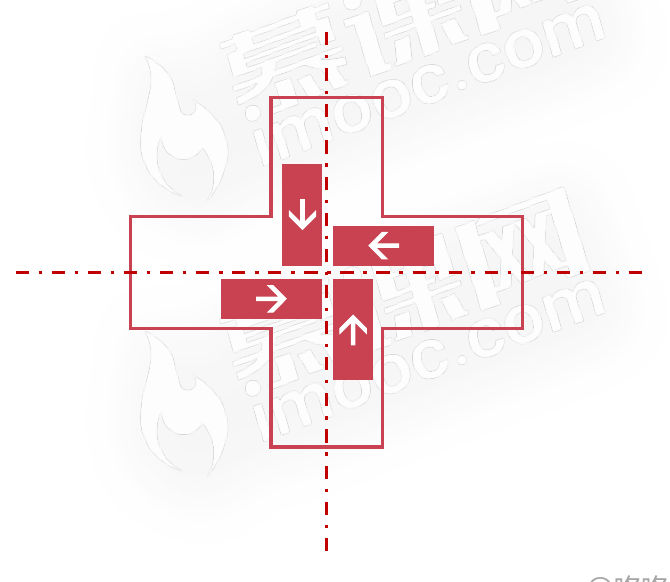
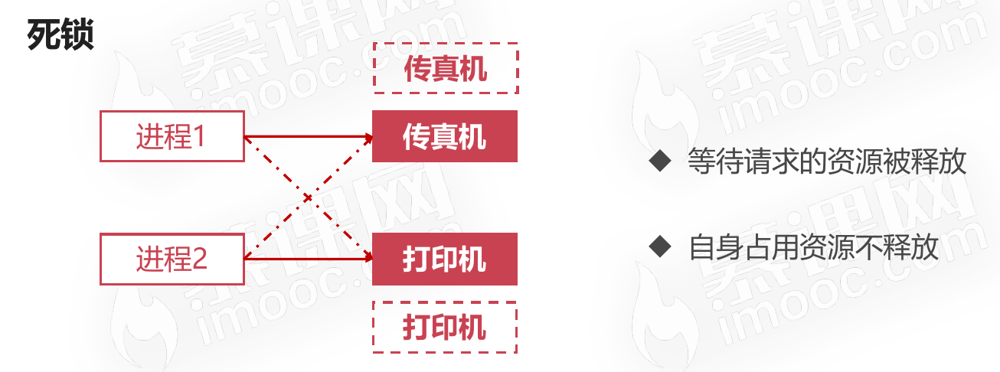
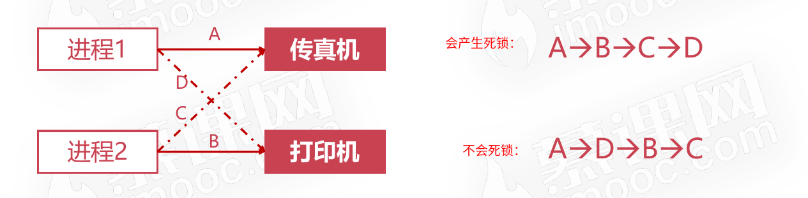
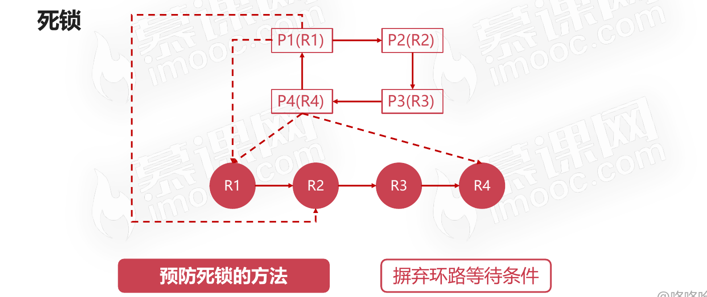
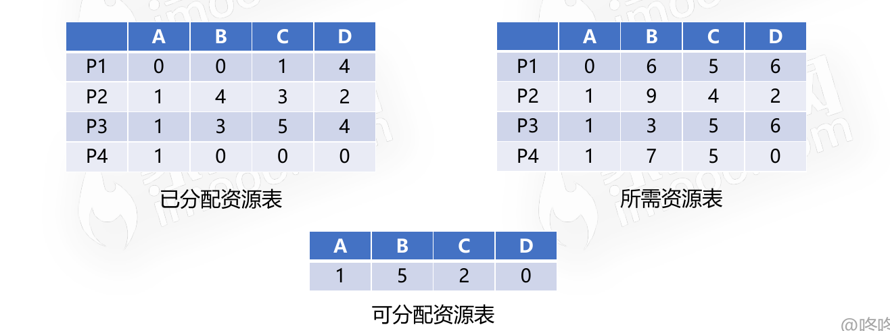
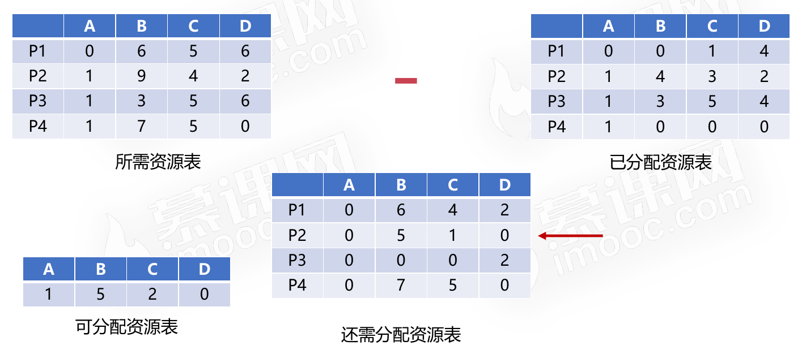
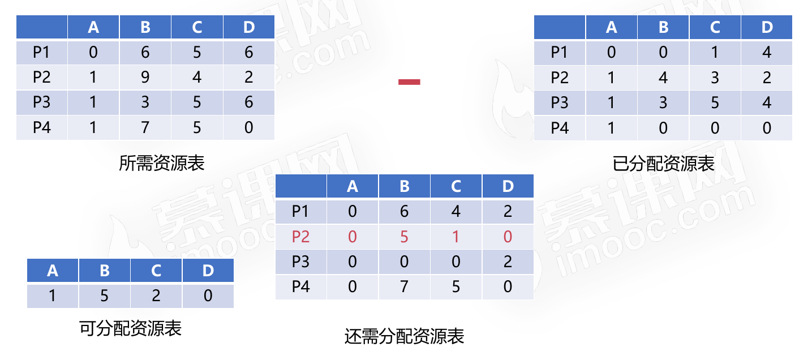

# 作业管理之死锁

## 死锁的概念

死锁是指两个或两个以上的进程在执行过程中,由于竞争资源或者由于彼此通信而造成的一种阻塞的现象,若无外力作用,它们都将无法推进下去。此时称系统处于死锁状态或系统产生了死锁,这些永远在互相等待的进程称为死锁进程。

## 死锁的产生

### 死锁产生的原因

* 竞争资源
  * 共享资源数量不满足各个进程需求
  * 各个进程之间发生资源进程导致死锁
  * 
* 进程调度顺序不当
  * 

### 死锁的四个必要条件

* 互斥条件
  * 进程对资源的使用是排他性的使用
  * 某资源只能由一个进程使用,其他进程需要使用只能等待
* 请求保持条件
  * 进程至少保持一个资源,又提出新的资源请求
  * 新资源被占用,请求被阻塞
  * 被阻塞的进程不释放自己保持的资源
* 不可剥夺条件
  * 进程获得的资源在未完成使用前不能被剥夺
  * 获得的资源只能由进程自身释放
* 环路等待条件
  * 发生死锁时,必然存在进程-资源环形链
  * 

## 死锁的处理

### 预防死锁的方法

可以破坏死锁的四个必要条件之一来达到预防死锁的目的。

* 摒弃请求保持条件
  * 系统规定进程运行之前,一次性申请所有需要的资源
  * 进程在运行期间不会提出资源请求,从而摒弃请求保持条件
* 摒弃不可剥夺条件
  * 当一个进程请求新的资源得不到满足时,必须释放占有的资源
  * 进程运行时占有的资源可以被释放,意味着可以被剥夺
* 摒弃环路等待条件
  * 可用资源线性排序,申请必须按照需要递增申请
  * 线性申请不再形成环路,从而摒弃了环路等待条件
  * 
  * 

### 银行家算法

银行家算法是一个可操作的著名的避免死锁的算法；是以银行借贷系统分配策略为基础的算法。

#### 前提

* 客户申请的贷款是有限的,每次申请需声明最大资金量
* 银行家在能够满足贷款时,都应该给用户贷款
* 客户在使用贷款后,能够及时归还贷款

#### 具体流程示意图

只有进程P2可以在**可分配资源表里**分到**自己还需分配的资源**，待进程P2资源使用完毕释放资源后，再给P1或者P2或者P3分配对应的资源，线程资源使用完毕后必须要归还资源。

