# 存储管理之内存分配与回收

## 背景

早期计算机编程并不需要过多的存储管理，随着计算机和程序越来越复杂,存储管理成为必要。

## 为什么需要内存分配

* 确保计算机有足够的内存处理数据
* 确保程序可以从可用内存中获取一部分内存使用
* 确保程序可以归还使用后的内存以供其他程序使用

## 内存分配的过程

### 内存分配的方式

#### 单一连续分配

* 单一连续分配是最简单的内存分配方式
* 只能在单用户、单进程的操作系统中使用
* 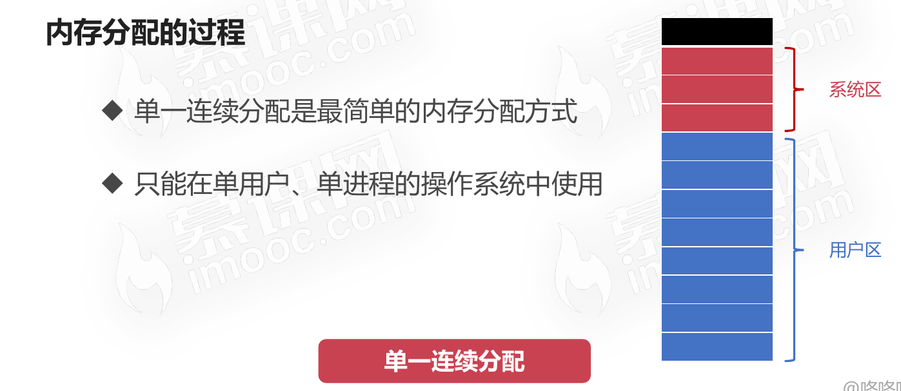

#### 固定分区分配

* 固定分区分配是支持多道程序的最简单存储分配方式
* 内存空间被划分为若干固定大小的区域
* 每个分区只提供给一个程序使用,互不干扰
* 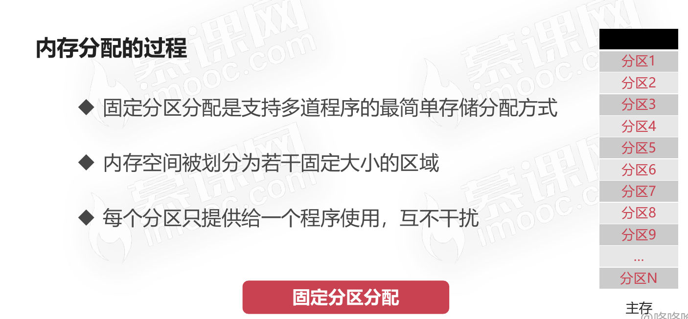

#### 动态分区分配

* 根据进程实际需要,动态分配内存空间
* 需要相关数据结构、分配算法的支持
* 动态分区空闲表数据结构
  * 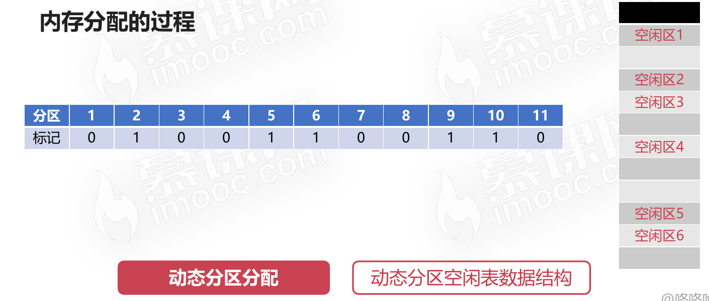
* 动态分区空闲链数据结构
  * 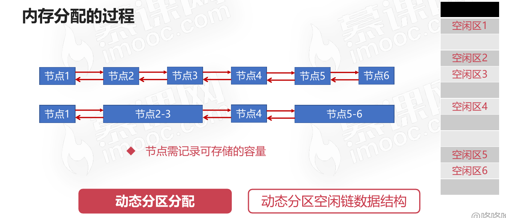

### 动态分区分配算法

* 首次适应算法(FF算法)
  * 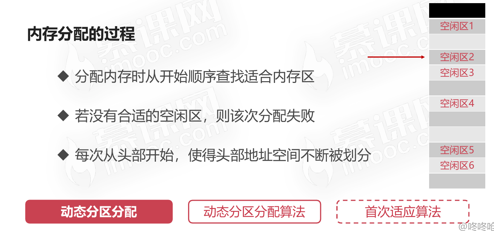
* 最佳适应算法(BF算法)
  * 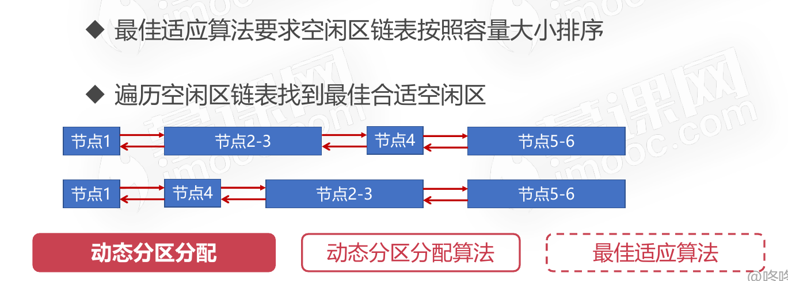
* 快速适应算法(QF算法)
  * 

## 内存回收的过程

### 分4种场景

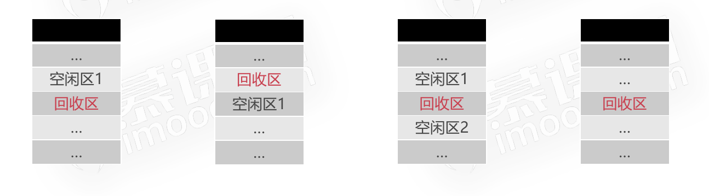

### 场景一：回收区位于空闲区的下方

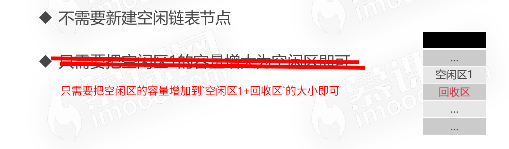

### 场景二：回收区位于空间区的上方

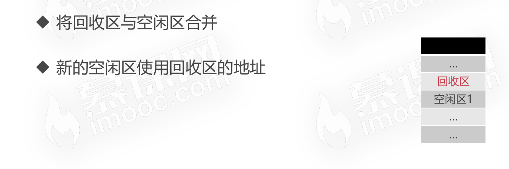

### 场景三：回收区位于两个空间区的中间

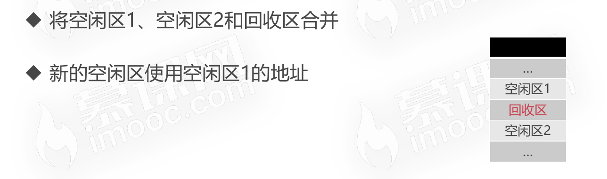

### 场景四：回收区自己没有相邻的空闲区

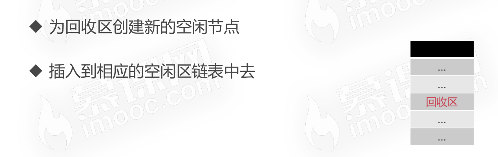