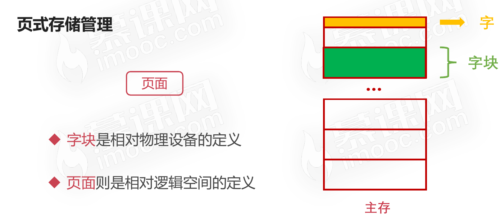
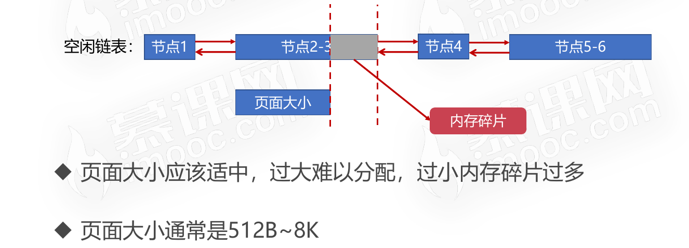
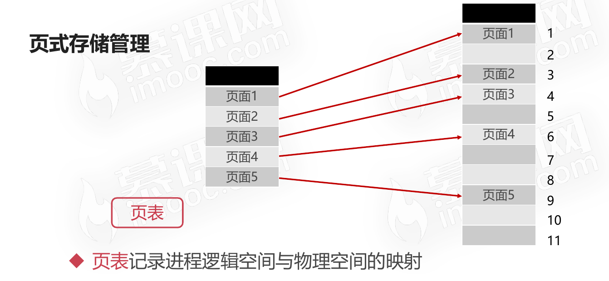
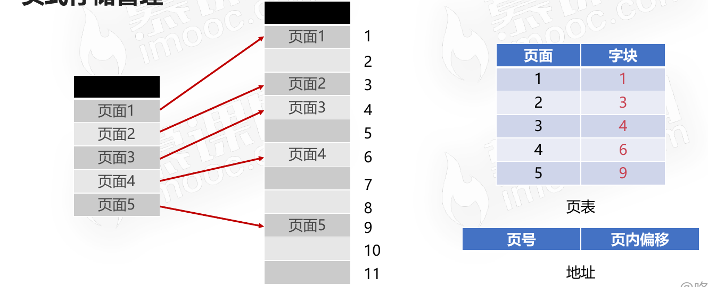
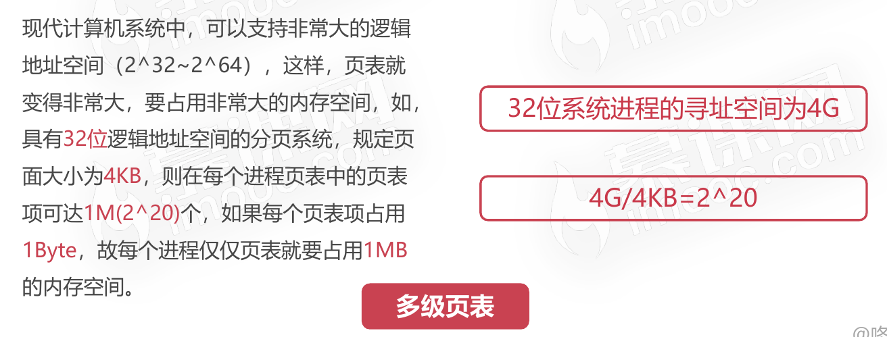
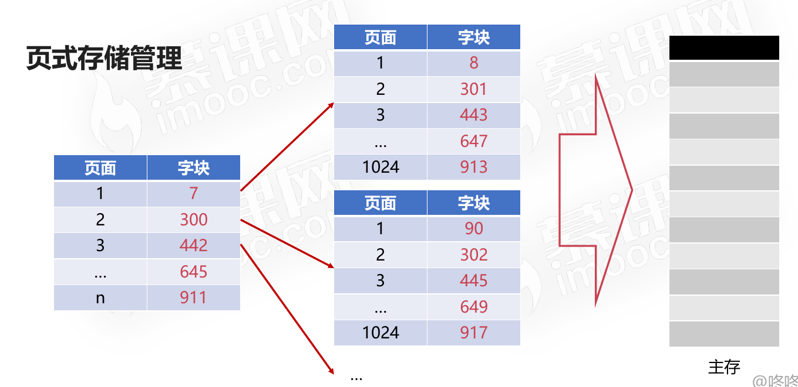
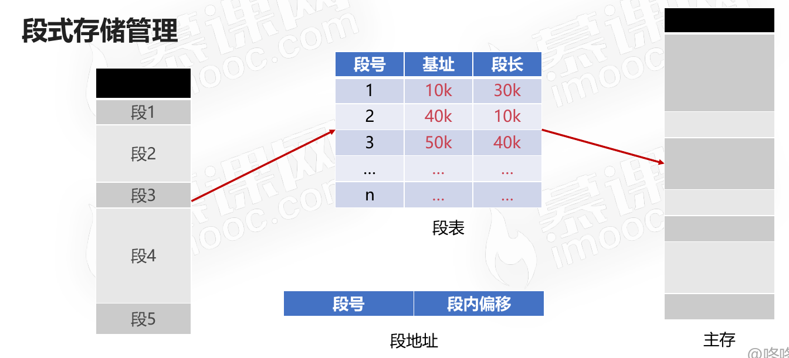
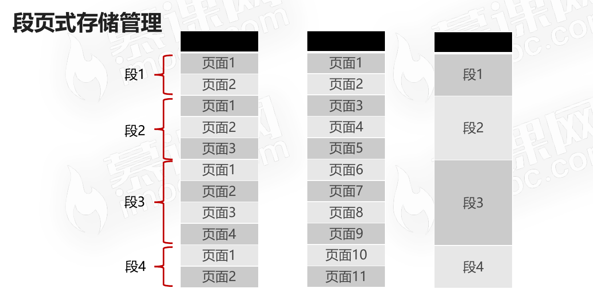

# 存储管理之段页式存储管理

## 页式存储管理

* 将进程逻辑空间等分成若干大小的页面
* 相应的把物理内存空间分成与页面大小的物理块
* 以页面为单位把进程空间装进物理内存中分散的物理块

### 内存碎片

### 页表

### 多级页表

### 页式存储管理缺点

有一段连续的逻辑分布在多个页面中,将大大降低执行效率。

## 段式存储管理

* 将进程逻辑空间划分成若干段(非等分)
* 段的长度由连续逻辑的长度决定
* 主函数MAIN、子程序段X、子函数Y等

### 段式存储和页式存储的区别

* 相同点：段式存储和页式存储都离散地管理了进程的逻辑空间
* 不同点：
  * 页是物理单位,段是逻辑单位
  * 分页是为了合理利用空间,分段是满足用户要求
  * 页大小由硬件固定,段长度可动态变化
  * 页表信息是一维的,段表信息是二维的

## 段页式存储管理

### 概念

* 分页可以有效提高内存利用率(虽然说存在页内碎片)
* 分段可以更好满足用户需求
* 两者结合,形成段页式存储管理

