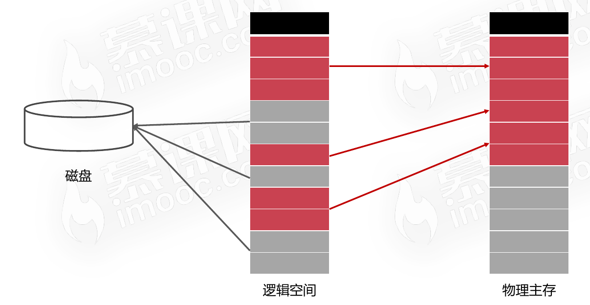
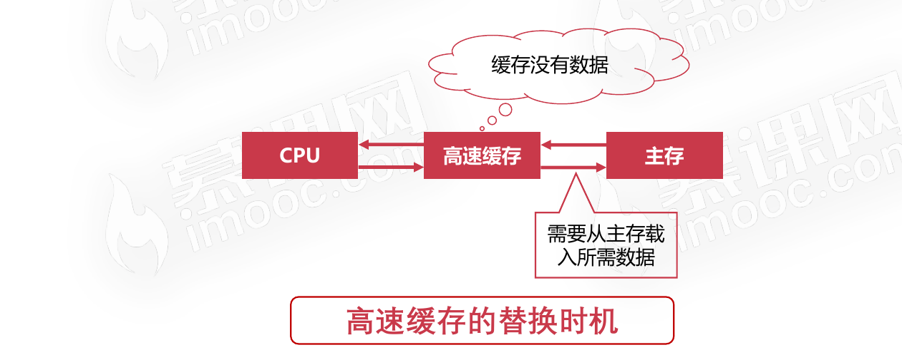
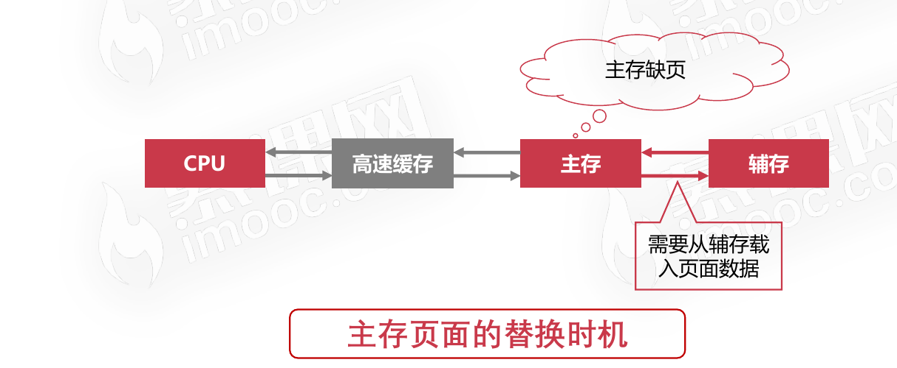

# 存储管理之虚拟内存

一个游戏十几G,物理内存只有4G,那这个游戏是怎么运行起来的?

## 虚拟内存概述

### 为什么需要虚拟内存？

* 有些进程实际需要的内存很大,超过物理内存的容量
* 多道程序设计,使得每个进程可用物理内存更加稀缺
* 不可能无限增加物理内存,物理内存总有不够的时候

### 什么是虚拟内存？

* 虚拟内存是操作系统内存管理的关键技术
* 使得多道程序运行和大程序运行成为现实
* 把程序使用内存划分,将部分暂时不使用的内存放置在辅存
* 

## 程序的局部性原理

### 局部性原理的内容

局部性原理是指CPU访问存储器时,无论是存取指令还是存取数据,所访问的存储单元都趋于聚集在一个较小的连续区域中。

### 虚拟内存实现的方式

虚拟内存实际是对物理内存的补充,速度接近于内存,成本接近于辅存。

* 程序运行时,无需全部装入内存,装载部分即可
* 如果访问页不在内存,则发出缺页中断,发起页面置换
* 从用户层面看,程序拥有很大的空间,即是虚拟内存

## 虚拟内存的置换算法

* 先进先出算法(FIFO)
* 最不经常使用算法(LFU)
* 最近最少使用算法(LRU)

