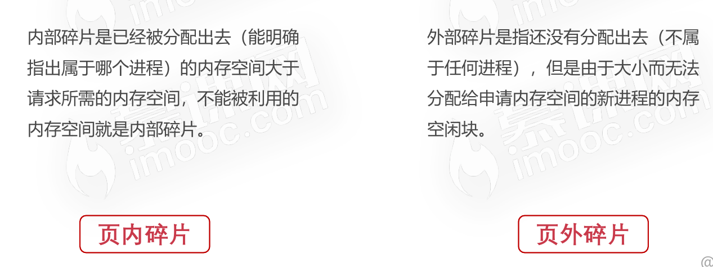
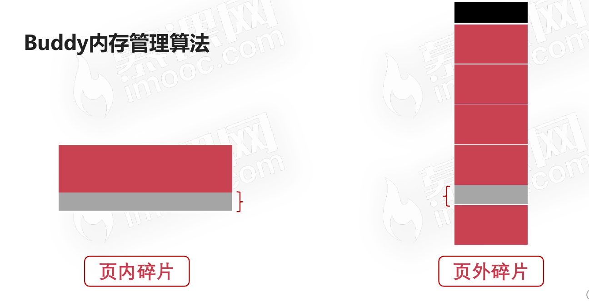
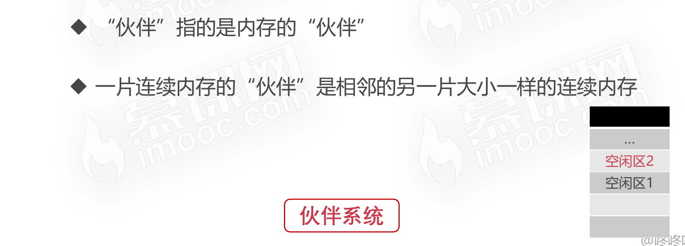
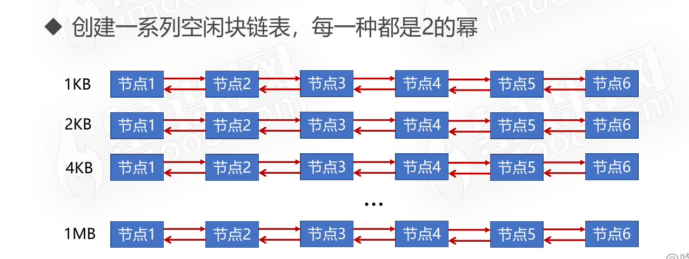
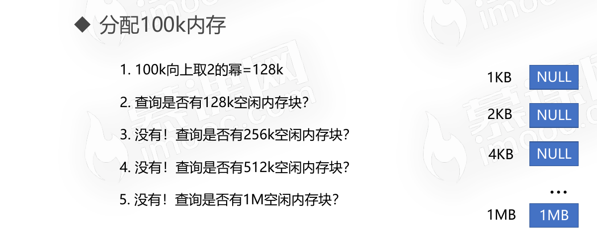
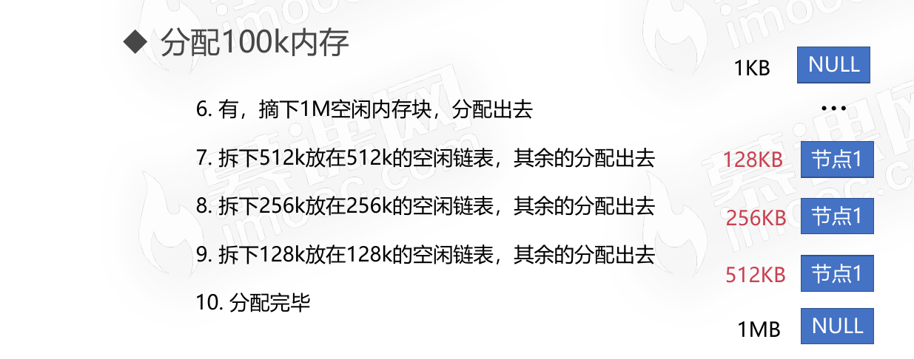
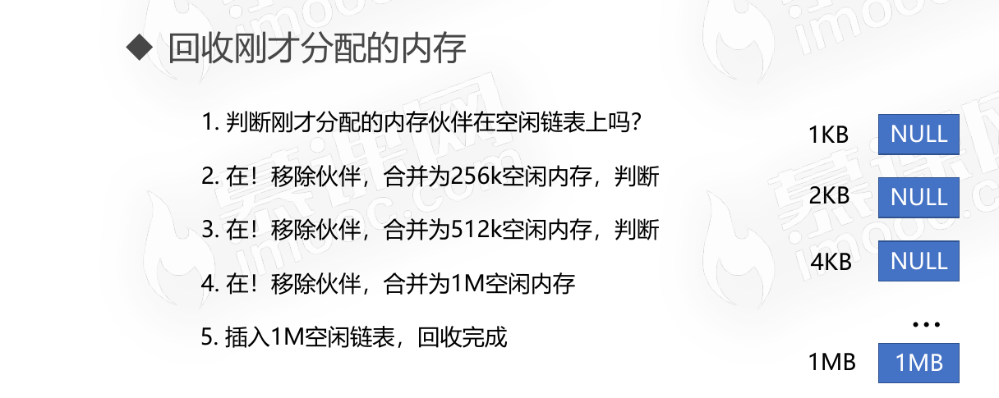
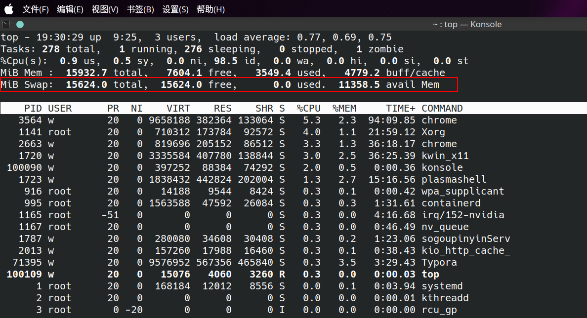

# Linux的存储管理

## Buddy内存管理算法

* Buddy算法是经典的内存管理算法
* 算法基于计算机处理二进制的优势具有极高的效率
* 算法主要是为了解决`内存外碎片`的问题， 努力让内存分配与相邻内存合并能快速进行。
* 算法本质上还是将`内存外碎片问题`转到为`内存内碎片问题`。

### 页内碎片和页外碎片

### Buddy内存管理算法内容

## Linux交换空间

* 交换空间(Swap)是磁盘的一个分区
* Linux物理内存满时,会把一些内存交换至Swap空间
* Swap空间是初始化系统时配置的

### 查看系统Swap空间

### Swap的主要用途

* 冷启动内存依赖
* 系统睡眠依赖
* 大进程空间依赖

### Swap空间和虚拟内存的区别

