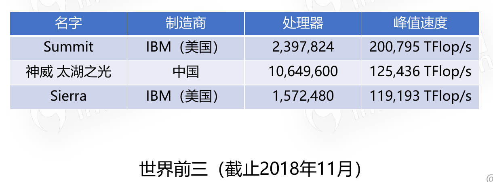
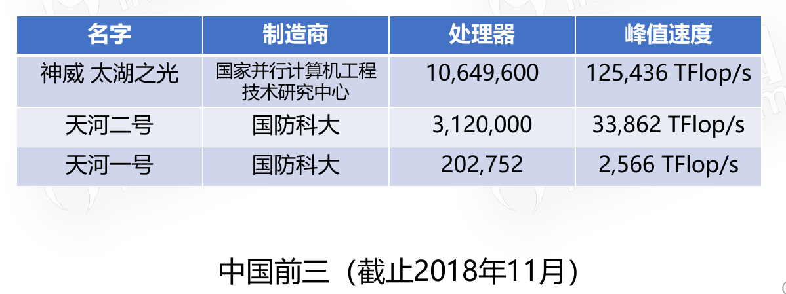
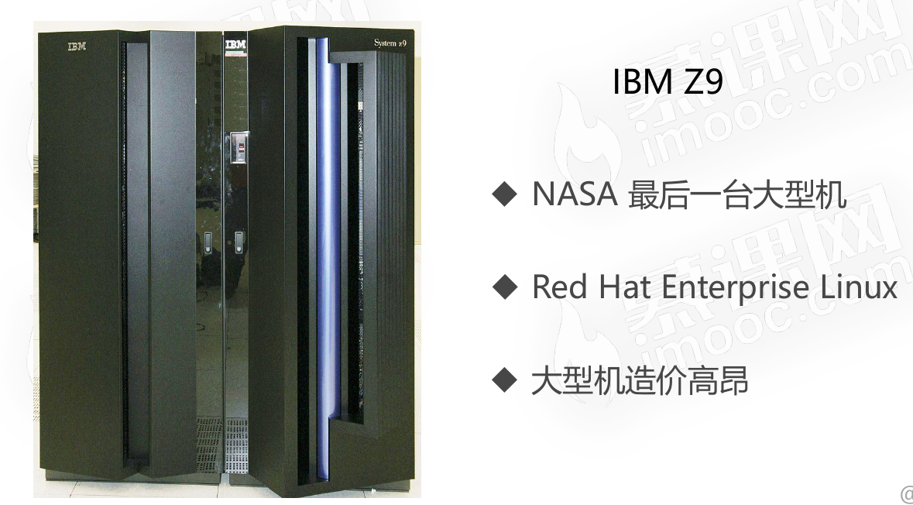
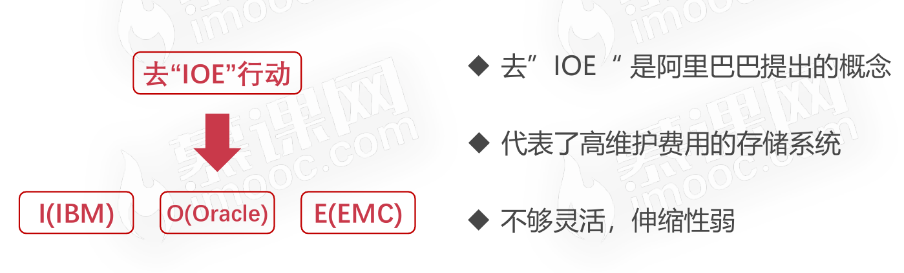
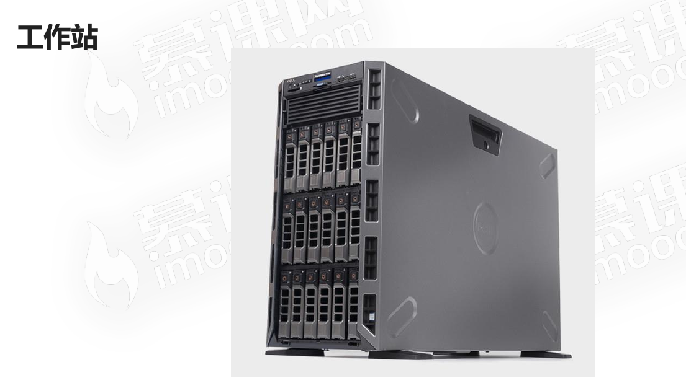
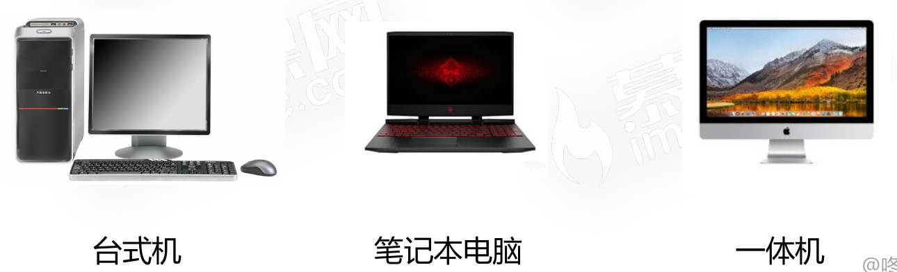

# 计算机分类

## 超级计算机

### 简介

* 功能最强、运算速度最快、存储容量最大的计算机
* 多用于国家高科技领域和尖端技术研究

### 运算速度

* 运算速度的单位是TFlop/s(1TFlop/s=每秒一万亿次浮点计算)
* Intel(R) Core(TM) i7-6700K CPU @ 4.00GHz的计算机的运算速度为44.87 GFlop/s
* 44.87 GFlop/s = 0.04487TFlop/s；还不及超级计算机运算速度的1&frasl;10。

### 超级计算机排名

世界排名

中国排名

## 大型计算机

### 简介

* 又称大型机、大型主机、主机等
* 具有高性能,可处理大量数据与复杂的运算
* 在大型机市场领域,IBM占据着很大的份额

### 去"IOE"行动

## 迷你计算机(服务器)

### 简介

* 也称为小型机,普通服务器
* 不需要特殊的空调场所
* 具备不错的算力,可以完成较复杂的运算
* 国内常见的服务器的制造商为：联想、华为、浪潮

现在普通服务器已经代替了传统的大型机,成为大规模企业计算的中枢。

## 工作站

### 简介

* 高端的通用微型计算机,提供比个人计算机更强大的性能
* 类似于普通台式电脑,体积较大,但性能强劲

## 微型计算机

### 简介

又称为个人计算机,是最普通的一类计算机

微型计算机麻雀虽小、五脏俱全。从构成的本质上来讲,个人计算机与前面的分类无异。

其中`迷你计算机(也称服务器)`和`微型计算机`是生活中比较常见的计算机。

