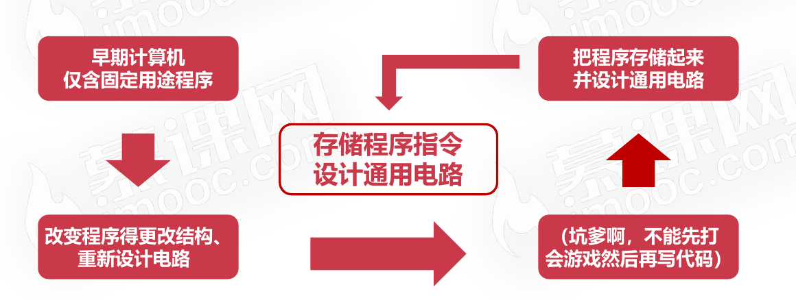
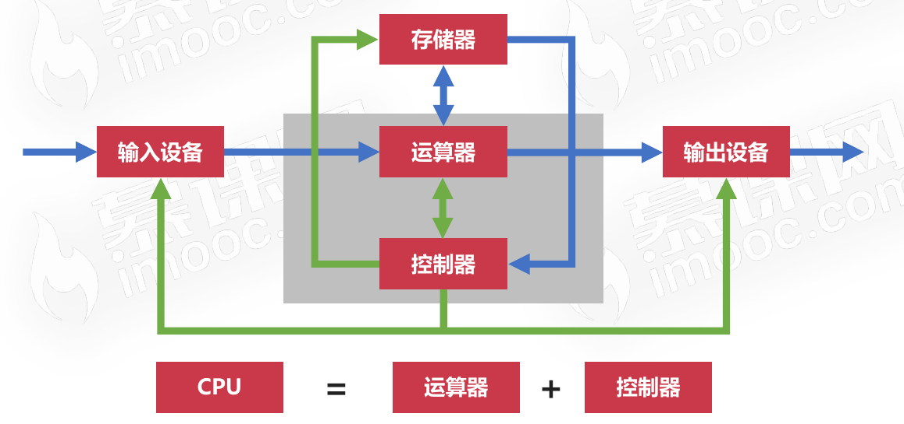
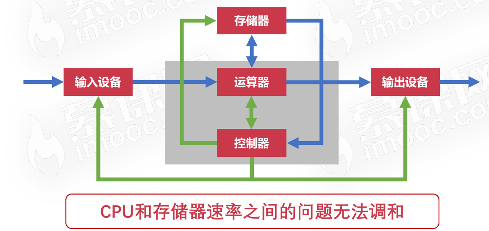
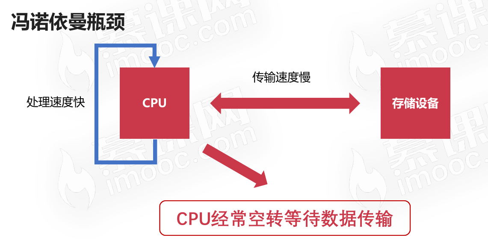
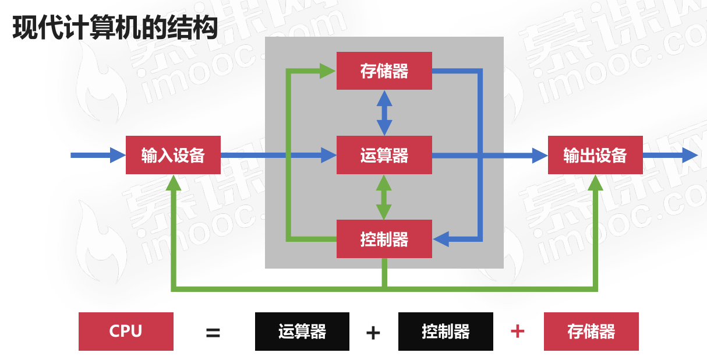
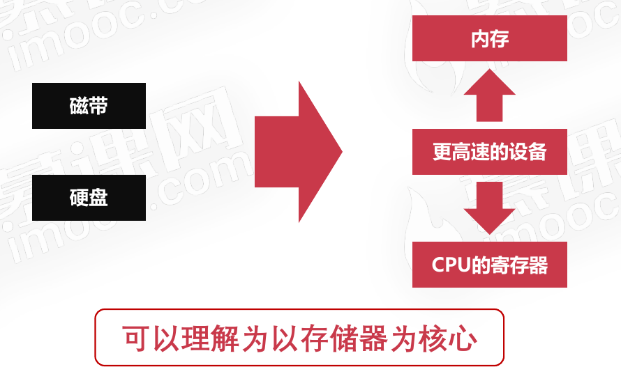

# 计算机的体系与结构

## 冯诺依曼体系

### 概念解释

将程序指令和数据一起存储的计算机设计概念结构

### 冯诺依曼体系产生的历史背景

冯诺依曼体系的核心就是`存储程序指令和涉及通用电路`。

### 冯诺依曼体系的组成

* 存储器、控制器、运算器、输入设备、输出设备。现代计算机都是冯诺依曼机。
* 

### 冯诺依曼体系的特点

* 能够把需要的程序和数据送至计算机中
* 能够长期记忆程序、数据、中间结果及最终运算结果的能力
* 能够具备算术、逻辑运算和数据传送等数据加工处理的能力
* 能够按照要求将处理结果输出给用户

### 冯诺依曼瓶颈

由于冯诺依曼瓶颈的存在，由此出现了现代计算机的结构。

## 现代计算机的结构

### 背景

* 现代计算机在冯诺依曼体系结构基础上进行修改
* 解决CPU与存储设备之间的性能差异问题

### 现代计算机的结构组成

主要是对存储器做了优化

