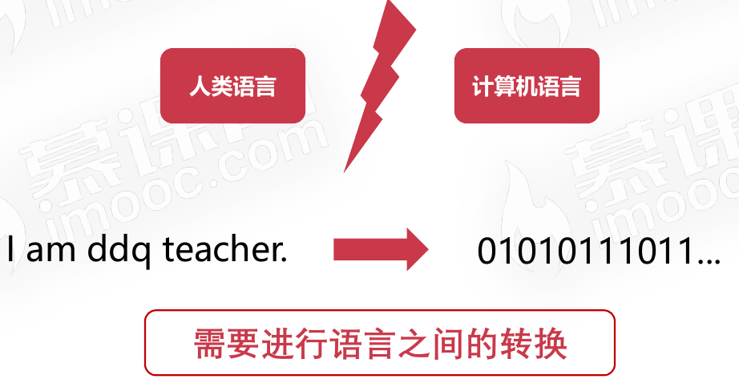
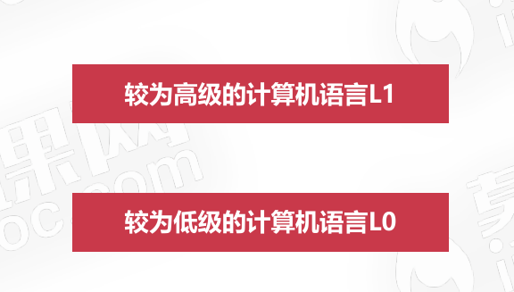
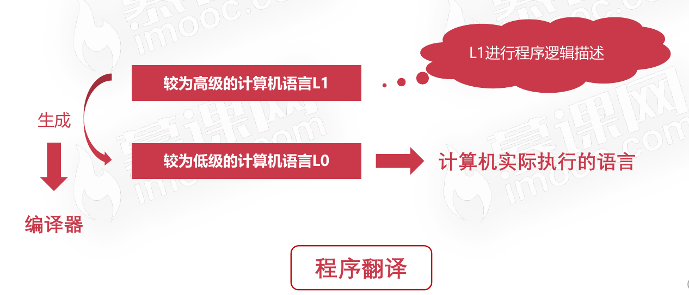
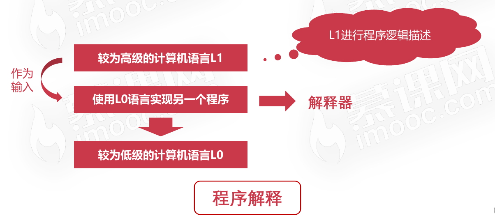
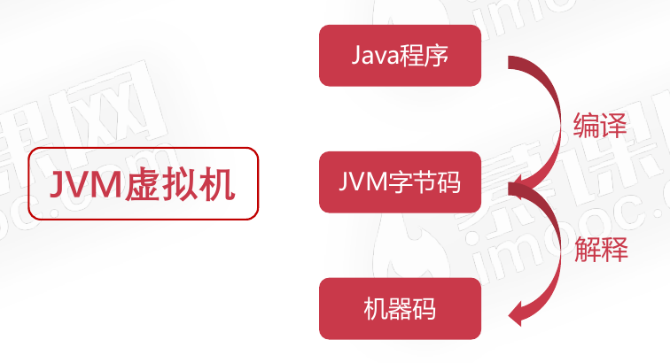
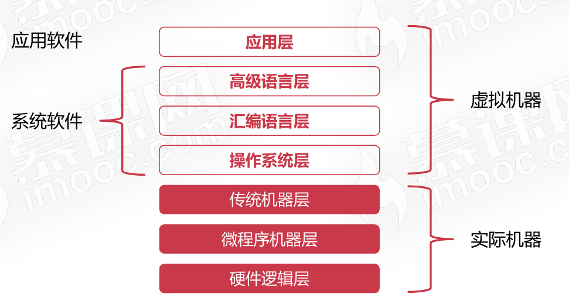
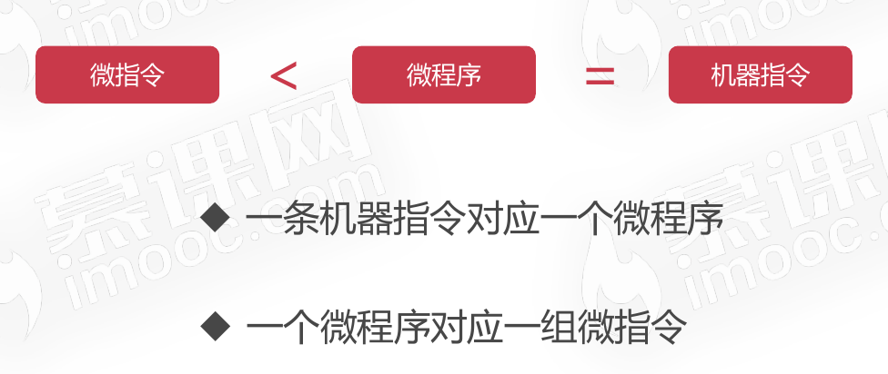
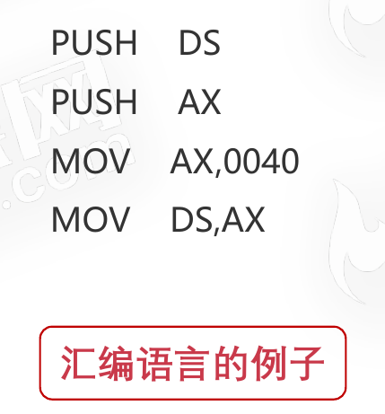

# 计算机的层次与编程语言

## 程序翻译与程序解释

### 背景

人类语言和计算机语言是不通的，需要一种介质来对人类语言和计算机语言进行转换。

在计算机中，所有的数据在[存储](https://baike.baidu.com/item/存储)和运算时都要使用[二进制](https://baike.baidu.com/item/二进制/361457)数表示(因为计算机用[高电平](https://baike.baidu.com/item/高电平/9753092)和[低电平](https://baike.baidu.com/item/低电平/6946314)分别表示1和0)

### 详细介绍

以以下的例子来进行介绍

#### 程序翻译

#### 程序解释

### 以上述例子来看程序翻译和程序解释的区别

* 计算机执行的指令都是L0
* 翻译过程生成新的L0程序,解释过程不生成新的L0程序
* 解释过程由L0编写的解释器去解释L1程序

### 常见的程序翻译和程序解释的语言

程序翻译

* C/C++
* Object-C
* Golang

程序解释

* Python
* Php
* Javascript

程序翻译+解释

* Java
* C# 

以Java语言为例子来说明它属于`程序翻译+解释`

## 计算机的层次

### 硬件逻辑层

* 门、触发器等逻辑电路组成
* 属于电子工程的领域

### 微程序机器层

* 编程语言是微指令集
* 微指令所组成的微程序直接交由硬件执行
* 

### 传统机器层

* 编程语言是CPU指令集(机器指令)
* 编程语言和硬件是直接相关
* 不同架构的CPU使用不同的CPU指令集(Intel和AMD的CPU使用的是不同的指令集)

### 操作系统层

* 向上提供了简易的操作界面
* 向下对接了指令系统,管理硬件资源
* 操作系统层是在软件和硬件之间的适配层

### 汇编语言层

* 编程语言是汇编语言
* 汇编语言可以翻译成可直接执行的机器语言
* 完成翻译的过程的程序就是**汇编器**
* 

### 高级语言层

* 编程语言为广大程序员所接受的高级语言
* 高级语言的类别非常多,由几百种
* 常见的高级语言有:Python、Java、C/C++、Golang、JavaScript等

### 应用层

* 满足计算机针对某种用途而专门设计
* 

