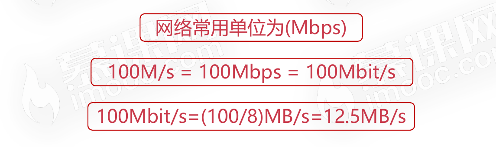

# 计算机的计算单位

## 容量单位

### 容量单位的基本单位bit(比特位)

* 在物理层面,高低电平([高电平](https://baike.baidu.com/item/高电平/9753092)和[低电平](https://baike.baidu.com/item/低电平/6946314)分别表示1和0)记录信息
* 理论上只认识0/1两种状态
* 0/1能够表示的内容太少了,需要更大的容量表示方法
* 字节:1Byte=8bits

### 常见的容量单位之间的换算关系

1G内存,可以存储多少字节的数据?可以存储多少比特数据?

为什么网上买的移动硬盘500G,格式化之后就只剩465G了?

## 速度单位

### 网络速度

为什么电信拉的100M光纤,测试峰值速度只有12M每秒?

### CPU频率

CPU速度

* CPU的速度一般体现为CPU的时钟频率
* CPU的时钟频率的单位一般是赫兹(Hz)
* 主流CPU的时钟频率都在2GHz以上
* Hz其实就是秒分之一，并不是描述计算机领域所专有的单位，它是每秒中的周期性变动重复次数的计量。
* 